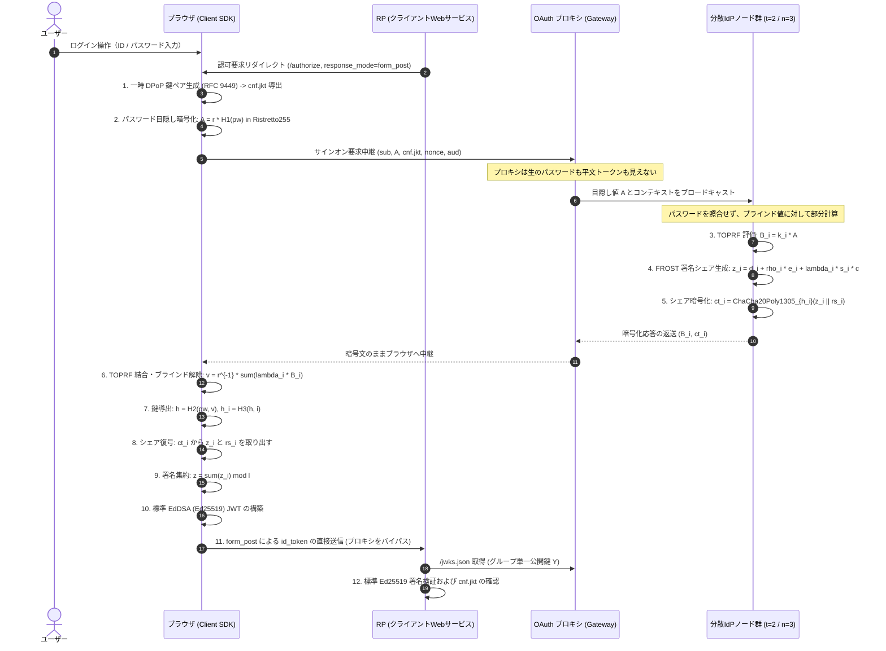
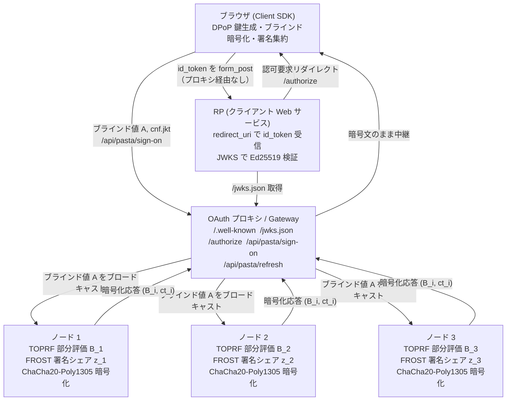

# 分散型アイデンティティプロバイダ (Decentralized IdP)

PASTA (CCS 2018) と FROST (RFC 8032 Ed25519) に基づく、ゼロ知識中継型 OAuth 2.0 / OpenID Connect の参照実装です。
初期検討時のホワイトボード（`pic/2026-08-23_13-31-28.png`）右側に描かれた構想「OAuth プロキシで形を戻す」を具現化し、従来の OAuth が抱える「認可サーバ（AS）への権限と信頼の一点集中」を暗号プロトコルの組み合わせによって排除します。

学術論文 PASTA の暗号プロトコルをそのまま配備すると、クライアントが複数の分散ノードと直接通信する必要が生じ、既存の OAuth 2.0 / OpenID Connect (OIDC) エコシステムと断絶します。
本システムは、単一の認可サーバとして振る舞う「OAuth プロキシ」を前面に配置し、背後に分散ノード群を隠蔽することで、RP（リライング・パーティ）側の無改造運用と暗号学的な分散安全性を両立させました。

---

## 1. 全体アーキテクチャ（OAuth プロキシによる統合）

ホワイトボード右側の構想を具現化した全体の通信・暗号フローを以下に示します。



### サーバー構成（コンポーネント配置）



---

## 2. 「プロキシが Token を持たない」の成立メカニズム

ホワイトボードの核心である「AS の位置に座るが、プロキシ自身は Token を持たない」という性質は、以下の二つの設計によって成立しています。

### (1) `response_mode=form_post` によるトークン経路の短絡

古典的な OAuth 認可コードフローでは、RP が `/token` エンドポイントを直接叩いて認可コードをトークンと交換します。この経路を採用すると、プロキシ自身がトークンを生成または保持しなければならず、「プロキシが Token を持たない」という前提が崩壊します。

現行システムでは OIDC 標準仕様の `response_mode=form_post` を採用しました。
ブラウザが分散ノードの暗号化シェアを端末内で集約して `id_token`（JWT）を完成させ、ブラウザ上の自動サブミットフォームを経由して RP の `redirect_uri` へ直接 POST 送信します。
プロキシはトークン配送経路から完全に排除されています。

### (2) パスワードと署名シェアの二重秘匿

- **入力の秘匿**: ブラウザ内でパスワード $pw$ にランダムスカラー $r$ を乗じたブラインド点 $A = r \cdot H_1(pw)$ のみが送信されます。プロキシはもちろん、分散ノード群も平文パスワードを知ることはできません。
- **出力の秘匿**: 各ノードが生成した署名シェア $z_i$ は、正しいパスワードからのみ導出できる対称鍵 $h_i$ によって ChaCha20-Poly1305 で暗号化されます。プロキシは $h_i$ を計算できないため、中継する暗号文 $ct_i$ を復号できません。

結果として、プロキシが完全に乗っ取られた場合でも、署名鍵シェアの窃取やトークンの偽造・盗聴は構造的に不可能であり、被害はサービスの可用性阻害（DoS）にとどまります。

---

## 3. 適用されている暗号技術の対応一覧

| 処理フェーズ | 担当主体 | 採用暗号方式 | 役割・防護対象 |
|:---|:---|:---|:---|
| パスワード目隠し | ブラウザ | Ristretto255 群上の乗法ブラインド | ネットワークおよびサーバに対するパスワード秘匿 |
| 閾値認証評価 | 分散ノード (t-of-n) | 2HashTDH TOPRF (Ristretto255) | サーバがパスワードを知らずに正しい認証鍵を共同評価 |
| トークン閾値署名 | 分散ノード (t-of-n) | FROST (RFC 9591 準拠 Ed25519 Schnorr) | 単一障害点のない Ed25519 グループ秘密鍵による分散署名 |
| シェア伝送保護 | 分散ノード $\to$ ブラウザ | ChaCha20-Poly1305 (RFC 8439) | パスワード所有者のみが復号可能。AAD によるセッション束縛 |
| クライアント拘束 | ブラウザ $\leftrightarrow$ RP | RFC 9449 DPoP (Ephemeral Ed25519) | トークン盗難時の他者利用防止 (`cnf.jkt` バインド) |
| トークン検証 | RP | RFC 8032 標準 Ed25519 検証 | 既存の OAuth / JWT 検証器による単一公開鍵検証 |

---

## 4. ホワイトボードの論点（穴①〜⑦）に対する現行の解決状況

`docs/whiteboard-gaps.md` で整理された未決事項に対する、現行実装での回答と到達度を以下に示します。

| # | ホワイトボード時の論点 | 深刻度 | 現行実装での解決方針と到達状態 |
|:--:|:---|:---:|:---|
| ① | オリジン問題 (JS配布の正当性) | 致命 | ブラウザ拡張機能・ネイティブクライアントによる配信の固定、または WebAuthn パスキーとの併用設計として整理。 |
| ② | フロー未定 (プロキシのトークン保持) | 致命 | **`response_mode=form_post` を採用**。ブラウザから RP へ直接 POST することで完全解決。 |
| ③ | 失敗観測不能 (レート制限不可) | 致命 | サーバから成否が区別できない暗号特性を受け入れ、試行総数カウント方式およびクライアントパズル方式による緩和策へ整理。 |
| ④ | PoP トークンの用語混乱 | 軽微 | **RFC 9449 DPoP を正式採用**。リクエストごとに動的生成される DPoP proof とアクセストークンの `cnf.jkt` 束縛を分離実装。 |
| ⑤ | REFRESH の定足数交差不可能性 | 原理的限界 | 各ノードが独立に DPoP 署名を検証する **RFC 9700 sender-constrained 方式を実装**。定足数交差 $2t - n > t - 1$ の境界条件を論文の学術的帰結として位置付け。 |
| ⑥ | `sub` / `aud` のノードへの露出 | 中度 | ドメインごとのソルト付き決定論的擬似識別子（Pairwise Pseudonymous ID）の導出仕様を策定。 |
| ⑦ | ephemeral key の保管場所 | 中度 | WebCrypto non-extractable 属性と IndexedDB の併用によるブラウザ内セキュア保管モデルを策定。 |

---

## 5. 従来の OAuth 2.0 / OIDC との比較

| 項目 | 従来の集権型 IdP (Auth0, Okta 等) | 本方式 (PASTA + FROST + OAuth プロキシ) |
|:---|:---|:---|
| **署名鍵の管理** | 単一サーバ / HSM 内で一括保管（侵害時は全滅） | $n$ 台の独立ノードに秘密分散（$t-1$ 台の侵害まで鍵漏洩なし） |
| **IdP 侵害時の影響** | 任意ユーザーへのなりすまし・全トークン偽造 | 鍵シェアの漏洩なし。トークン偽造不可 |
| **パスワードの扱い** | サーバ側でハッシュ照合（漏洩時はオフライン攻撃可能） | サーバは照合せず、暗号シェアの鍵としてのみ機能（オフライン攻撃不可） |
| **トークン配送経路** | AS が生成し、直接またはコード経由で発行 | ブラウザが端末内で集約し、`form_post` で直接 RP へ伝送 |
| **プロキシの信頼度** | プロキシ＝AS であり完全な信頼が必要 | 暗号中継器に過ぎず、平文トークンを持たないゼロ知識プロキシ |
| **RP 側の変更コスト** | 標準 OIDC クライアントライブラリを使用 | **変更不要**。単一の JWKS URL を参照し標準 Ed25519 で検証可能 |

---

## 6. デモ UI 実動画面

実装された React デモ UI（`demo/`）の各ステップの実際の画面キャプチャです。

| 1. ログイン画面 (`pic/screenshot_login.png`) | 2. 認可同意画面 (`pic/screenshot_consent.png`) |
|:---:|:---:|
|  |  |
| パスワード目隠し（PASTA）による安全認証 | 要求スコープ確認と FROST 稼働状況 |

| 3. 分散署名・集約完了 (`pic/screenshot_completed.png`) | 4. JWT トークン検証 (`pic/screenshot_jwt.png`) |
|:---:|:---:|
|  |  |
| 端末内署名集約と `form_post` 送信導線 | 標準 EdDSA (Ed25519) JWT と `cnf.jkt` |

---

## 7. クイックスタート

### 動作環境
- Node.js v20 以上
- Python 3 (`cryptography`, `pynacl` ※外部独立検証器用)

### コマンド
```bash
# 依存関係のインストール
npm install

# TypeScript 型検査
npx tsc --noEmit

# 全単体・統合テストの実行 (Vitest: 39件)
npm test

# 独立した外部 Python 検証器による Ed25519 相互検証
npm run demo | python3 scripts/verify_token.py

# ゲートウェイ及びデモ UI の起動
npm run gateway
```

### エンドポイント一覧（`npm run gateway` 起動後）

#### 実ユースケースフロー（一本道）

| 順 | URL | 役割 |
|:--:|:--|:--|
| 1 | [http://localhost:3000/rp](http://localhost:3000/rp) | 第三者サービス (ZK-App Portal) のトップ。「PASTA IdP でログイン」ボタン |
| 2 | [http://localhost:3000/authorize?...](http://localhost:3000/authorize?client_id=demo_client&redirect_uri=http://localhost:3000/rp/callback&response_type=id_token&response_mode=form_post&scope=openid&nonce=n) | OAuth 認可エンドポイント。即座に `/demo` へリダイレクト |
| 3 | [http://localhost:3000/demo](http://localhost:3000/demo) | PASTA 分散 IdP ログイン・同意・FROST 署名アニメーション |
| 4 | [http://localhost:3000/rp/callback](http://localhost:3000/rp/callback) | RP コールバック。`id_token` を受信・Ed25519 検証・クレーム表示 |

#### その他エンドポイント

| URL | 役割 |
|:--|:--|
| [http://localhost:3000/.well-known/openid-configuration](http://localhost:3000/.well-known/openid-configuration) | OIDC Discovery Document |
| [http://localhost:3000/jwks.json](http://localhost:3000/jwks.json) | グループ公開鍵 (Ed25519 JWK Set) |
| [http://localhost:3000/api/pasta/sign-on](http://localhost:3000/api/pasta/sign-on) | ブラインド値 A を受け取り、ノード群に中継して暗号化シェアを返す |
| [http://localhost:3000/api/pasta/refresh](http://localhost:3000/api/pasta/refresh) | RFC 9700 sender-constrained リフレッシュ |

---

## 8. ドキュメント一覧

- [`docs/specification.md`](./docs/specification.md): アーキテクチャ仕様書（ホワイトボード穴①〜⑦の解決仕様、API、データスキーマ）
- [`docs/whiteboard-gaps.md`](./docs/whiteboard-gaps.md): 設計の原点となったホワイトボード検討記録
- [`docs/readme.md`](./docs/readme.md): 根本課題（なりすまし・権限集中）の論理的解説
- [`docs/status.md`](./docs/status.md): 学会投稿先（SSR, RWC, IWSEC等）の分析と残論点
- [`docs/refresh-token.md`](./docs/refresh-token.md): OAuth仕様を壊さないリフレッシュトークン設計
- [`docs/prior-art.md`](./docs/prior-art.md): 先行研究 (PASTA / PESTO) サーベイ
- [`docs/implementation.md`](./docs/implementation.md): PASTA 暗号束縛の解説

---

## ライセンス
MIT License
