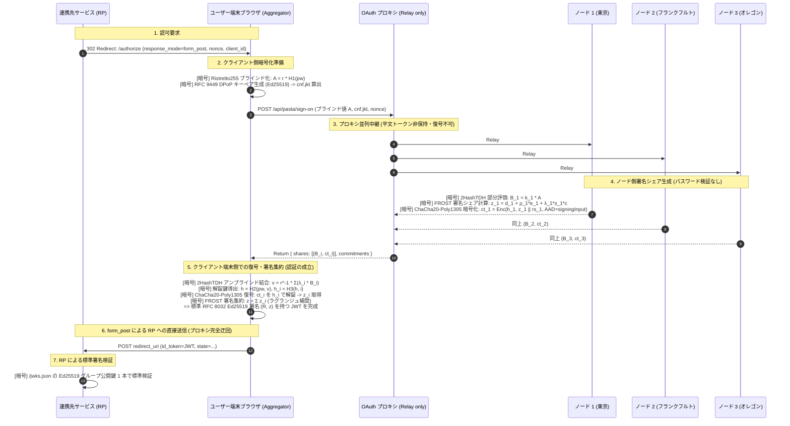

# 分散型アイデンティティプロバイダ (Decentralized IdP)

PASTA (CCS 2018) と FROST (RFC 8032 Ed25519) に基づく、ゼロ知識中継型 OAuth 2.0 / OpenID Connect の参照実装です。
従来のOAuthが抱える「認可サーバ（AS）への権限と信頼の一点集中」を、暗号プロトコルの組み合わせによって排除します。

---

## 1. 従来のOAuthの課題と本アーキテクチャによる解決

従来の集権的IdPでは、認証判定を行う権限と署名を発行する権限の双方が単一組織に集中しています。本設計ではこれらを分離し、暗号学的制約によって不正を防ぎます。

| 従来のOAuth / IdPの弱点 | 根本原因 | 本アーキテクチャでの解決策 | 担当する暗号技術 |
|:---|:---|:---|:---|
| **IdP運営者によるなりすまし** | 単一サーバがJWT署名秘密鍵を保持している | 署名鍵を $n$ 台に分散し、単一ノード単体では署名不能にする | **FROST Ed25519 閾値署名** ($t$-of-$n$) |
| **認証を無視したトークン不正発行** | 認証と署名が疎結合であり、DB改竄で署名のみを発火できる | 署名シェアをパスワード由来の鍵で暗号化。認証の成立を「端末が復号できるか」に物理束縛する | **PASTA 方式** (2HashTDH TOPRF + ChaCha20-Poly1305) |
| **中継プロキシによるトークン盗聴** | 認可コード交換時に AS がトークンを生成・把握する | ブラウザ端末が集約したトークンを、`form_post` で直接 RP へ届ける（プロキシをバイパス） | **`response_mode=form_post`** (OIDC標準) |
| **トークンの横取り・不正再利用** | トークン単体で利用可能なベアラ形式である | 端末が生成したエフェメラル公開鍵のサムプリントをトークンに焼き込み、DPoP署名のない通信を拒否 | **RFC 9449 DPoP 束縛** (`cnf.jkt`) |
| **リフレッシュトークン発行の集権化** | 認可サーバが単独で新しいアクセストークンを再発行できる | 各ノードが独立にDPoP署名を検証し、個別秘密 $rs_i$ から導出した鍵で新シェアを暗号化 | **RFC 9700 Sender-Constrained リフレッシュ** |

---

## 2. 暗号マッピング詳細アーキテクチャ

ブラウザ端末、中継プロキシ、分散ノード、RPの間で実行される暗号処理とデータフローの全容です。



---

## 3. デモ UI 実動画面

実装された React デモ UI（`demo/`）の各画面フローです。

| 1. ログイン画面 | 2. 認可同意画面 |
|:---:|:---:|
|  |  |
| パスワード目隠し（PASTA）による安全認証 | 要求スコープ確認と FROST 稼働状況 |

| 3. 分散署名・集約完了 | 4. JWT トークン検証 |
|:---:|:---:|
|  |  |
| 端末内署名集約と `form_post` 送信導線 | 標準 EdDSA (Ed25519) JWT と `cnf.jkt` |

---

## 4. クイックスタート

### 動作環境
- Node.js v20 以上
- Python 3 (`cryptography`, `pynacl` ※外部独立検証器用)

### コマンド
```bash
# 依存関係のインストール
npm install

# TypeScript 型検査
npx tsc --noEmit

# 全単体・統合テストの実行 (Vitest: 39件)
npm test

# 独立した外部 Python 検証器による Ed25519 相互検証
npm run demo | python3 scripts/verify_token.py

# ゲートウェイ及びデモ UI の起動
npm run gateway
```

ブラウザで [http://localhost:3000](http://localhost:3000) または [http://localhost:3000/demo](http://localhost:3000/demo) を開くと、分散署名プロトコルの可視化UIを操作できます。

---

## 5. ドキュメント一覧

- [`docs/whiteboard-current.md`](./docs/whiteboard-current.md): 現行アーキテクチャ解説（ホワイトボード右側「OAuthプロキシで形を戻す」の具現化と暗号マッピング）
- [`docs/specification.md`](./docs/specification.md): アーキテクチャ仕様書（ホワイトボード穴①〜⑦の解決仕様、API、データスキーマ）
- [`docs/whiteboard-gaps.md`](./docs/whiteboard-gaps.md): 設計の原点となったホワイトボード検討記録
- [`docs/readme.md`](./docs/readme.md): 根本課題（なりすまし・権限集中）の論理的解説
- [`docs/status.md`](./docs/status.md): 学会投稿先（SSR, RWC, IWSEC等）の分析と残論点
- [`docs/refresh-token.md`](./docs/refresh-token.md): OAuth仕様を壊さないリフレッシュトークン設計
- [`docs/prior-art.md`](./docs/prior-art.md): 先行研究 (PASTA / PESTO) サーベイ
- [`docs/implementation.md`](./docs/implementation.md): PASTA 暗号束縛の解説

---

## ライセンス
MIT License
