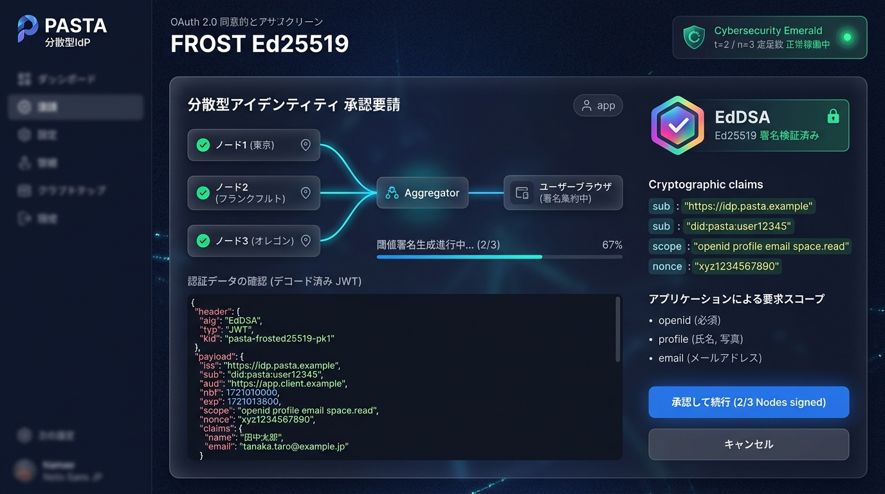

# 分散型アイデンティティプロバイダ (Decentralized IdP)

> **PASTA (CCS 2018) + FROST (RFC 8032 Ed25519) に基づくゼロ知識中継型 OAuth 2.0 / OpenID Connect 実装**

[](./tests/)
[](./src/jwt/)
[](./src/gateway/)
[](./src/client-sdk/)

---

## 📸 デモ画面 (React 18 + Tailwind CSS)



ブラウザで [http://localhost:3000](http://localhost:3000) にアクセスすると、東京・フランクフルト・オレゴンの 3 つの分散ノードとの暗号化通信・FROST 署名集約・JWT 発行をリアルタイムに体験できます。

---

## 💡 特徴と解決している課題

最上位の脅威は **なりすまし**（IdP 運営者の乗っ取りによる全サービス不正アクセス）です。本システムは以下の仕組みにより権限の一点集中を排除します：

1. **署名鍵の完全分散 (FROST Ed25519 閾値署名)**:
   - 署名鍵 $s$ はどのサーバーにも揃っておらず、$t$-of-$n$（例: 2-of-3）のシェア $s_i$ に分散。
2. **忘却型暗号認証 (PASTA 方式 - CCS 2018)**:
   - サーバーは**パスワードを一切検証しません**。署名シェア $z_i$ をパスワード由来の鍵 $h_i$ で暗号化して返却。
   - 正しいパスワードを持つ端末のみがローカル復号して署名を合成できます。
3. **「Token を持たない AS」OAuth プロキシ (RFC 標準互換)**:
   - OIDC 標準の **`response_mode=form_post`** を採用。
   - ブラウザが集約したトークンを直接 RP の `redirect_uri` へ送信するため、プロキシは暗号化シェアを中継するのみで平文トークンを一切観測・保持できません。
4. **DPoP プルーフとリフレッシュトークン (RFC 9449 / RFC 9700)**:
   - リクエスト単位のエフェメラル鍵による DPoP 束縛 (`cnf.jkt`)。
   - 各ノードが独立に DPoP 署名を検証してセッション秘密 $rs_i$ から新シェアを発行。

---

## 🚀 クイックスタート

### 動作環境
- Node.js (v20 以上推奨)
- Python 3 (`cryptography`, `pynacl` ※外部検証テスト用)

### インストール & テスト
```bash
# 依存パッケージのインストール
npm install

# TypeScript 型チェック
npx tsc --noEmit

# 全単体・統合テストの実行 (Vitest: 38件)
npm test

# 独立した Python 検証器による Ed25519 相互検証 & 改竄遮断テスト
npm run demo | python3 scripts/verify_token.py
```

### ゲートウェイ & デモ UI の起動
```bash
npm run gateway
```
- **React デモ画面**: [http://localhost:3000](http://localhost:3000) または [http://localhost:3000/demo](http://localhost:3000/demo)
- **OIDC Discovery**: [http://localhost:3000/.well-known/openid-configuration](http://localhost:3000/.well-known/openid-configuration)
- **OIDC JWKS**: [http://localhost:3000/jwks.json](http://localhost:3000/jwks.json)

---

## 📚 ドキュメント体系一覧

本リポジトリの設計・理論・仕様は以下のドキュメントに体系化されています：

| ドキュメント | 内容 |
|:---|:---|
| [`docs/specification.md`](./docs/specification.md) | **【決定版仕様書】** ホワイトボードの穴①〜⑦の解決仕様、プロトコル定義、API 仕様 |
| [`docs/whiteboard-gaps.md`](./docs/whiteboard-gaps.md) | ホワイトボードで議論された構成と 7 つの穴（設計の経緯） |
| [`docs/readme.md`](./docs/readme.md) | 分散 IdP の根本動機、脅威モデル、なりすまし防止理論 |
| [`docs/status.md`](./docs/status.md) | プロジェクト到達度と学会投稿先（SSR, RWC, IWSEC 等）の分析 |
| [`docs/prior-art.md`](./docs/prior-art.md) | 先行研究サーベイ (PASTA / PESTO) の詳細比較 |
| [`docs/refresh-token.md`](./docs/refresh-token.md) | 論点 G: OAuth を壊さずにリフレッシュトークンを実装する設計考察 |
| [`docs/implementation.md`](./docs/implementation.md) | PASTA 方式における暗号学的束縛のからくり・役割整理 |
| [`demo/README.md`](./demo/README.md) | React デモフロントエンドの構造と機能解説 |

### 🔬 高度暗号技術リサーチ資料
- [`docs/research/tfhe-hardware-optimizations.md`](./docs/research/tfhe-hardware-optimizations.md): TFHE-rs の物理レイヤ・ハードウェア最適化（動的 SIMD、`dyn-stack`、特化型 FFT、CUDA カーネル融合等）の全貌
- [`docs/research/tfhe-pbs-overview.md`](./docs/research/tfhe-pbs-overview.md): TFHE のプログラマブル・ブートストラッピング（PBS）の理論と高速化手法まとめ

---

## 📜 ライセンス
MIT License
