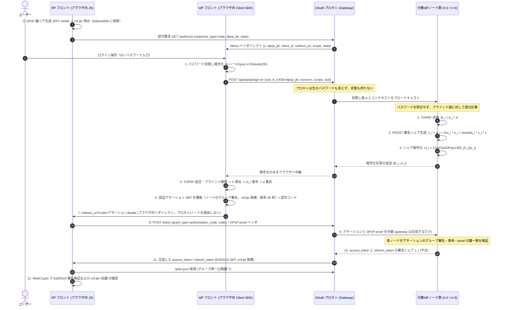
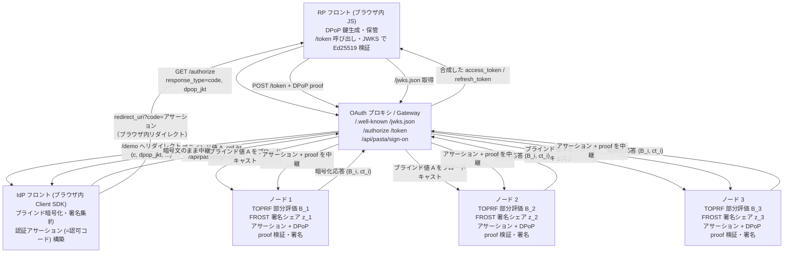
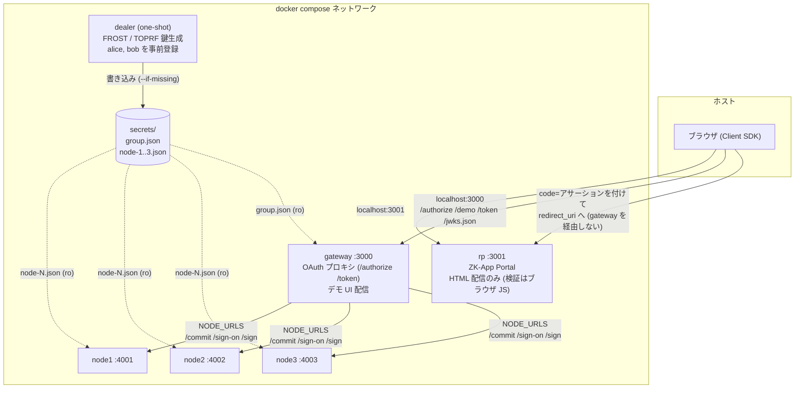

# 分散型アイデンティティプロバイダ (Decentralized IdP)

PASTA (CCS 2018) と FROST (RFC 8032 Ed25519) に基づく、ゼロ知識中継型 OAuth 2.0（認可コードフロー + DPoP）の参照実装です。
初期検討時のホワイトボード（`pic/2026-08-23_13-31-28.png`）右側に描かれた構想「OAuth プロキシで形を戻す」を具現化し、従来の OAuth が抱える「認可サーバ（AS）への権限と信頼の一点集中」を暗号プロトコルの組み合わせによって排除します。

学術論文 PASTA の暗号プロトコルをそのまま配備すると、クライアントが複数の分散ノードと直接通信する必要が生じ、既存の OAuth 2.0 エコシステムと断絶します。
本システムは、単一の認可サーバとして振る舞う「OAuth プロキシ」を前面に配置し、背後に分散ノード群を隠蔽することで、RP（リライング・パーティ）側の標準的な運用と暗号学的な分散安全性を両立させました。
発行するトークンは標準の Ed25519 署名付き JWT で、`cnf.jkt` によって RP の DPoP 鍵に束縛されます。認可サーバ役の gateway はユーザー状態を一切持たず（ステートレス）、単独ではトークンを発行できません。

---

## 1. 全体アーキテクチャ（OAuth プロキシによる統合）

ホワイトボード右側の構想を具現化した全体の通信・暗号フローを以下に示します。



### サーバー構成（コンポーネント配置）



### コンテナ構成（`docker-compose.yml`）

上図の論理配置を、そのままコンテナ 1 つずつに割り当てたものです。設計契約は
[`docs/container-split.md`](./docs/container-split.md)。



起動順は `depends_on` で固定されています。`dealer` の
`service_completed_successfully` を node1..3 が待ち、3 ノードの
`service_healthy` を gateway が待ち、gateway の `service_healthy` を rp が待ちます。

---

## 2. 「プロキシが Token を持たない」の成立メカニズム

ホワイトボードの核心である「AS の位置に座るが、プロキシ自身は Token を持たない」という性質は、以下の二つの設計によって成立しています。

### (1) 認可コード＝ノード署名アサーション、`/token` 署名の分散化

古典的な OAuth 認可コードフローでは、認可サーバ（AS）が不透明な認可コードを発行してサーバ側でセッションを保持し、`/token` でそのコードをトークンに交換します。この経路をそのまま採用すると、プロキシ自身がコード発行とトークン署名の権能を握り、「プロキシが Token を持たない」という前提が崩壊します。

現行システムは、この 2 段階のどちらからもプロキシの単独権能を取り除きました。

- **認可コードは「認証アサーション」そのもの**です。ブラウザ（IdP フロント）が分散ノードの暗号化シェアを端末内で集約し、ノードのグループ署名が付いた JWT（寿命 30 秒、RP の DPoP 鍵に `cnf.jkt` で束縛）を作ります。これが RFC 6749 の認可コードとして機能します。正しいパスワードを知る者だけがこのアサーションを組み立てられ、gateway もノードも生成できません（gateway はセッションもコードストアも持ちません）。
- **`/token` の署名はノードが行います**。RP フロントがアサーションと自分の DPoP 鍵で署名した proof を `/token` に送ると、gateway はそれをノードへ中継するだけです。各ノードがアサーションのグループ署名・寿命・proof の鍵が `cnf.jkt` に一致することを**自分で検証**してから `access_token` と `refresh_token` の署名シェアを返し、gateway はそれを合成します。gateway は単独ではトークンを作れません。

トークンは `/token` の応答として gateway を通過しますが、すべて `cnf.jkt` で RP の DPoP 鍵に束縛されるため、gateway が中身を見ても行使できません。だからこそトークンが gateway を通ってもよいのです。

### (2) パスワードと署名シェアの二重秘匿

- **入力の秘匿**: ブラウザ内でパスワード $pw$ にランダムスカラー $r$ を乗じたブラインド点 $A = r \cdot H_1(pw)$ のみが送信されます。プロキシはもちろん、分散ノード群も平文パスワードを知ることはできません。
- **出力の秘匿**: 各ノードが生成した署名シェア $z_i$ は、正しいパスワードからのみ導出できる対称鍵 $h_i$ によって ChaCha20-Poly1305 で暗号化されます。プロキシは $h_i$ を計算できないため、中継する暗号文 $ct_i$ を復号できません。

結果として、プロキシが完全に乗っ取られた場合でも、署名鍵シェアの窃取やトークンの偽造・盗聴は構造的に不可能であり、被害はサービスの可用性阻害（DoS）にとどまります。

---

## 3. 適用されている暗号技術の対応一覧

| 処理フェーズ | 担当主体 | 採用暗号方式 | 役割・防護対象 |
|:---|:---|:---|:---|
| パスワード目隠し | ブラウザ | Ristretto255 群上の乗法ブラインド | ネットワークおよびサーバに対するパスワード秘匿 |
| 閾値認証評価 | 分散ノード (t-of-n) | 2HashTDH TOPRF (Ristretto255) | サーバがパスワードを知らずに正しい認証鍵を共同評価 |
| トークン閾値署名 | 分散ノード (t-of-n) | FROST (RFC 9591 準拠 Ed25519 Schnorr) | 単一障害点のない Ed25519 グループ秘密鍵による分散署名 |
| シェア伝送保護 | 分散ノード $\to$ ブラウザ | ChaCha20-Poly1305 (RFC 8439) | パスワード所有者のみが復号可能。AAD によるセッション束縛 |
| クライアント拘束 | RP フロント $\leftrightarrow$ node | RFC 9449 DPoP (Ephemeral Ed25519) | `/token` で各ノードが proof を検証してから署名。発行トークンを RP の鍵に `cnf.jkt` で束縛し、盗難時の他者利用を防止 |
| トークン検証 | RP フロント (ブラウザ内 JS) | RFC 8032 標準 Ed25519 検証 | WebCrypto による単一公開鍵検証 (署名・`iss`・`aud`・`exp`・`cnf.jkt`=自鍵) |

---

## 4. ホワイトボードの論点（穴①〜⑦）に対する現行の解決状況

`docs/whiteboard-gaps.md` で整理された未決事項に対する、現行実装での回答と到達度を以下に示します。

| # | ホワイトボード時の論点 | 深刻度 | 現行実装での解決方針と到達状態 |
|:--:|:---|:---:|:---|
| ① | オリジン問題 (JS配布の正当性) | 致命 | ブラウザ拡張機能・ネイティブクライアントによる配信の固定、または WebAuthn パスキーとの併用設計として整理。 |
| ② | フロー未定 (プロキシのトークン保持) | 致命 | **認可コード＝ノード署名アサーション + ノード署名の `/token`** を採用。認可コードはパスワードを知る者だけが作れるアサーション JWT で、gateway はセッションもコードストアも持たない。`/token` では各ノードがアサーションと DPoP proof を検証して閾値署名し、gateway は合成するだけ。プロキシは単独でトークンを作れず、状態も持たない。 |
| ③ | 失敗観測不能 (レート制限不可) | 致命 | サーバから成否が区別できない暗号特性を受け入れ、試行総数カウント方式およびクライアントパズル方式による緩和策へ整理。 |
| ④ | PoP トークンの用語混乱 | 軽微 | **RFC 9449 DPoP を正式採用**。リクエストごとに動的生成される DPoP proof とアクセストークンの `cnf.jkt` 束縛を分離実装。 |
| ⑤ | REFRESH の定足数交差不可能性 | 原理的限界 | 各ノードが独立に DPoP 署名を検証する **RFC 9700 sender-constrained 方式を実装**。定足数交差 $2t - n > t - 1$ の境界条件を論文の学術的帰結として位置付け。 |
| ⑥ | `sub` / `aud` のノードへの露出 | 中度 | ドメインごとのソルト付き決定論的擬似識別子（Pairwise Pseudonymous ID）の導出仕様を策定。 |
| ⑦ | ephemeral key の保管場所 | 中度 | WebCrypto non-extractable 属性と IndexedDB の併用によるブラウザ内セキュア保管モデルを策定。 |

---

## 5. 従来の OAuth 2.0 / OIDC との比較

| 項目 | 従来の集権型 IdP (Auth0, Okta 等) | 本方式 (PASTA + FROST + OAuth プロキシ) |
|:---|:---|:---|
| **署名鍵の管理** | 単一サーバ / HSM 内で一括保管（侵害時は全滅） | $n$ 台の独立ノードに秘密分散（$t-1$ 台の侵害まで鍵漏洩なし） |
| **IdP 侵害時の影響** | 任意ユーザーへのなりすまし・全トークン偽造 | 鍵シェアの漏洩なし。トークン偽造不可 |
| **パスワードの扱い** | サーバ側でハッシュ照合（漏洩時はオフライン攻撃可能） | サーバは照合せず、暗号シェアの鍵としてのみ機能（オフライン攻撃不可） |
| **認可コード** | AS が発行する不透明文字列。code→セッションを AS がサーバ側に保持 | ノードのグループ署名付き JWT (認証アサーション)。自己完結・寿命 30 秒・`cnf.jkt` 束縛で、どこにも保存しない |
| **トークン発行経路** | AS が単独で署名して発行 | 認可コード (アサーション) を `/token` へ。各ノードが DPoP proof を条件に閾値署名し、gateway が合成して `access_token` を返す |
| **プロキシの信頼度** | プロキシ＝AS であり完全な信頼が必要 | 状態を一切持たない中継器。単独ではトークンを作れず、束縛済みトークンを見ても行使できない |
| **RP 側の変更コスト** | 標準 OAuth クライアントライブラリを使用 | 標準の認可コードフロー + DPoP。単一の JWKS URL を参照し標準 Ed25519 で検証可能 |

---

## 6. デモ UI 実動画面

実装された React デモ UI（`projects/demo/`）の各ステップの実際の画面キャプチャです。

この UI は **クライアント SDK をブラウザ内で実行** します (`projects/demo/src/sdk/`)。
ブラインド化・`ct_i` の復号・署名の集約はすべてこの端末で起き、gateway はパスワードを
一切受け取りません。API が失敗したときに偽のトークンを作るフォールバックは無く、
エラーがそのまま画面に出ます。3. の「処理ログ」タブに、下の
「デモの進め方」で見るブラウザ列と同じ行が表示されます。

| 1. ログイン画面 (`pic/screenshot_login.png`) | 2. 認可同意画面 (`pic/screenshot_consent.png`) |
|:---:|:---:|
|  |  |
| パスワード目隠し（PASTA）による安全認証 | 要求スコープ確認と FROST 稼働状況 |

| 3. 分散署名・集約完了 (`pic/screenshot_completed.png`) | 4. JWT トークン検証 (`pic/screenshot_jwt.png`) |
|:---:|:---:|
|  |  |
| 端末内署名集約と認証アサーション (認可コード) の構築 | 標準 EdDSA (Ed25519) JWT と `cnf.jkt` 束縛 |

---

## 7. クイックスタート

### 動作環境
- Docker Engine 24 以上 / Docker Compose v2.23 以上 (`--wait` を使うため) ※コンテナ起動に必須
- **Node.js v20 以上**
  - **総合テスト (`scripts/integration-test.sh`) とデモ CLI (`projects/demo` の `npm run sign-on`) に必須**。
    どちらもブラウザと同じクライアント SDK を Node で実行するため、`globalThis.crypto` が WebCrypto であること・`fetch` が組み込みであることを前提にしています。
  - 各コンポーネント (`dealer`, `node`, `gateway`, `rp`) のローカル開発・単体テストにも使います。
  - `docker compose up` でスタックを起動してブラウザから触るだけなら不要です。
- tmux 3.x ※`scripts/demo-tmux.sh` で 5 列のログを並べる場合のみ (`brew install tmux`)

### Docker Compose での起動（推奨）

4 コンポーネント (`dealer`, `node` ×3, `gateway`, `rp`) をまとめて立ち上げます。

```bash
# secrets/ はホスト側に先に作る (bind mount 先が root 所有で作られるのを防ぐ)
mkdir -p secrets

# ビルドして起動し、全サービスが healthy になるまで待つ
docker compose up -d --build --wait

# 停止 (secrets/ は残るので、次回起動しても鍵は同じ)
docker compose down
```

初回は `dealer` が `secrets/` に鍵シェアとユーザーレコードを書き出します。2 回目以降は
`--if-missing` が効いて何も書かないため、**再起動しても鍵は変わりません**。鍵を作り直す
場合のみ以下を実行します。

```bash
docker compose down && rm -rf secrets
```

#### 公開ポート

| サービス | コンテナ | ホスト公開ポート | URL |
|:--|:--|:--:|:--|
| gateway (OAuth プロキシ + デモ UI) | `gateway` | 3000 | [http://localhost:3000](http://localhost:3000) |
| rp (ZK-App Portal) | `rp` | 3001 | [http://localhost:3001](http://localhost:3001) |
| ノード 1 | `node1` | 4001 | `http://localhost:4001/health` (デバッグ用) |
| ノード 2 | `node2` | 4002 | `http://localhost:4002/health` (デバッグ用) |
| ノード 3 | `node3` | 4003 | `http://localhost:4003/health` (デバッグ用) |

ノードのポートはデバッグ用の公開です。gateway はコンテナ間ネットワーク
(`http://node1:4001` など) でノードを呼びます。

#### 総合テスト

compose 構成そのものを外側から検証するスクリプトです。OAuth 認可コードフロー + DPoP
(契約 第 14 節) を外側から確認します。起動から、**ブラウザ役 CLI**
(`projects/demo/cli/sign-on.ts`) での `access_token` 取得 (authorize→sign-on→code(アサーション)
→`/token`)、外部検証器 (`node:crypto` のみ、IdP コード不使用) による Ed25519 検証
(`typ=at+jwt`, `aud=demo_client`, `cnf.jkt`)、`refresh_token` grant、**DPoP 束縛**
(proof 無しの `/token` は 400、別の鍵の proof も 400、`OPTIONS /token` の CORS が `DPoP` を許可)、
誤パスワード (アサーションが作れず認可コードに至らない)、デモログの中身、
ノード 1 台停止での 2-of-3 継続、2 台停止での失敗、復旧、鍵の永続まで 130 項目を確認します
(手元の Mac で約 77 秒)。

```bash
scripts/integration-test.sh

# スタックを落とさずに残して調べたいとき
KEEP_UP=1 scripts/integration-test.sh
```

「ブラウザ役」は gateway ではなく **ブラウザで動くのと同じ SDK** を Node で実行する CLI
です。そのため **Node.js 20 以上が必要** で、`projects/demo/node_modules` が無ければ
スクリプトが自動で `npm ci` します。

デモログの検証ステップでは、`docker compose logs` を読んで次を確認します。

- gateway の `sign-on   sess=<id>` の行に今回の `nonce` と `user=alice`、パスワード非受領の印
  (`(no pw)`) が同居し、`token grant=authz` の行に合成した `access_token` が出ている
- node1..3 に `sign … grant=authz … assertion σ … ✓` の行が出ている (アサーションと DPoP proof を検証して署名)
- **全サービスのログに `password123` が 0 件**、`secrets/node-1.json` の `secretKeyShare` の断片も 0 件
- node3 を止めたときの gateway ログに `(node3 unreachable, excluded)` が出る

終了時に `docker compose down` します (`--volumes` は付けないので `secrets/` は残ります)。
全項目が通れば exit 0、1 つでも落ちれば exit 1 です。

### デモの進め方

5 つのサービスのログを横に並べ、1 回のログインが各列にどう映るかを見せる手順です。
狙いは一点、**「ブラウザ (この端末) 以外は認可コード (認証アサーション) を組み立てる材料を揃えられない」**
ことを、動いているログで示すことです。

#### 1. スタックを起動する

```bash
mkdir -p secrets
docker compose up -d --build --wait
```

#### 2. 5 列のログを並べる

```bash
brew install tmux        # 未導入なら (macOS)
scripts/demo-tmux.sh     # tmux セッション pasta-demo を作って attach
```

`pasta-demo` セッションに 6 ペインが開きます。node1 / node2 / node3 / gateway / rp の
5 ペインが `docker compose logs -f --no-log-prefix` を流し、6 つ目にブラウザ役 CLI の
実行例が **入力済み・未実行** の状態で置かれます (Enter を押すと走ります)。

| 環境変数 / 引数 | 効果 |
|:--|:--|
| `scripts/demo-tmux.sh --up` | スタックが起動していなければ `docker compose up -d --build --wait` してから開く |
| `TAIL=0 scripts/demo-tmux.sh` | 過去ログを出さず、これから起きることだけを表示する |

既定は `--tail=5` です。`--tail=0` にすると各サービスの `● up` イベント
(`holds:` / `never:` — 何を持って立ち上がり、何を構造的に持ち得ないか) が流れて消えて
しまうため、起動直後の状態が画面に残るようにしています。

セッションを閉じるときは `tmux kill-session -t pasta-demo` です。

#### 3. ログインする

ブラウザで [http://localhost:3001/](http://localhost:3001/) を開き、「PASTA IdP でログイン」
から **alice / password123** でログインします (rp → gateway `/authorize` → デモ UI で
サインオン → 認可コード=アサーションを付けて rp `/callback` へ戻り、`/callback` の JS が
DPoP proof 付きで `/token` を叩いて `access_token` を得る、という認可コードフロー)。

rp のページを開いた時点で、そのページが DPoP 鍵ペアを作ります。秘密鍵は rp オリジンの
IndexedDB に `extractable=false` で残り、IdP に渡るのは公開鍵のサムプリント `dpop_jkt`
だけです (画面の「my DPoP jkt」)。デモ UI も gateway もノードもこの秘密鍵を持たないので、
`access_token` の `cnf.jkt` は最初から rp の鍵に束縛されます。`/callback` の画面は、保管して
ある鍵から計算し直した jkt とトークンの `cnf.jkt` の一致を ✓ で示します。

tmux の 6 つ目のペインで CLI を走らせても、**ブラウザと同じ SDK** が同じ順序で同じ計算を
します (CLI は rp フロント役も兼ねるので、自分で DPoP 鍵を作って jkt を SDK に渡します)。

```bash
cd projects/demo && npm run -s sign-on -- \
  --gateway http://localhost:3000 --user alice --password password123 \
  --client-id demo_client --nonce demo-1
```

`access_token` が stdout の最終行に、ブラウザ列のデモログが stderr に出ます。`--refresh`
を付けると、返ってきた `refresh_token` を新しい DPoP proof で `/token` に出して
新しい `access_token` に差し替えます。

#### 4. 各列の見どころ

同じログインが 5 列に同時に映ります。`sess=` が同じ行を追いかけてください。ログの本文は
英語で、`←` が受け取ったもの、`→` が計算したものです。何を構造的に持ち得ないかは各列の
`● up` 行の `never:` に 1 度だけ書かれます。

**node (青)** — サインオンでは自分のシェアで部分計算しただけ。`A` はブラインド化済みで
パスワードを復元できず、`z_i` は 3 分の 1 のシェアで単独では無意味、`ct_i` は自分の `h_i`
でしか復号できません。`/token` の `sign` 行では、受け取ったアサーションのグループ署名と
DPoP proof を**自分で検証**してから `access_token` と `refresh_token` の署名シェアを平文で
返します (`grant=authz` は初回、リフレッシュは `grant=refresh`)。

```
[node1]   ● up      id=1 t=2/3 users=alice,bob   holds: s_1, k_1, h_1(alice,bob)   never: pw, h, other s_i/k_i, sessions, access tokens
[node1]   sign-on   sess=a6a53052 round=82f28ca0 user=alice  ← A coT8wk_Z  (D,E)×3  nonce_s qgVbM_-T  jkt 0TrOdLq7
                    → B_1=k_1·A 9D1sWzzM  ct_1=AEAD_h1(z_1) YwcEpcuT
[node1]   sign      round=bca7717e grant=authz  ← assertion σ _VYSTBpv ✓  DPoP ✓ jti 4dff5fc8  (D,E)×3  → at z_1 06632051 + rt(refresh+jwt) z_1 0d389402
```

**gateway (マゼンタ)** — サインオンでは `A` と `ct_i` を中継するだけ。`h_i` を持たないので
`ct_i` を復号できず、`r` を知らないので `B_i` から `h` を導けません。`/token` の `token` 行
でも、受け取った `code`(アサーション) と DPoP proof をノードへ中継し、返った署名シェアを
**合成するだけ**です。合成後の `access_token` はログに出ますが、`cnf.jkt` で RP の鍵に
束縛されており gateway は行使できません。gateway はユーザー状態を一切持ちません。

```
[gateway] ● up      t=2/3 nodes=3 issuer=http://localhost:3000   holds: group pubkey, kid=pasta-group-key-1   never: s_i, k_i, h_i, pw
[gateway] sign-on   sess=a6a53052 round=82f28ca0 user=alice nonce=readme-1  ← A coT8wk_Z  jkt 0TrOdLq7  (no pw)
                    round1 (D,E)×3 → round2 ← B_i×3 ct_i×3 (no h_i, cannot decrypt) → relayed as-is
[gateway] token     grant=authz  ← code(assertion) eyJhbGci + DPoP ✓  → 2×/commit ×3 → /sign → access_token eyJhbGciOiJFZERT (cnf.jkt=0TrOdLq7) + refresh_token
```

**rp (緑)** — サーバは HTML を返すだけで、トークンには一切触れません。`landing` で
`response_type=code` の認可 URL を組み立て、`callback` では `code`(アサーション) を
**ブラウザのリダイレクトのクエリ**で受け取って、`/token` を叩く JS を含むページを返します。
トークン取得・DPoP proof 生成・Ed25519 検証はすべて `/callback` のブラウザ JS 内で起き、
rp サーバもノードも関与しません。

```
[rp]      ● up      issuer=http://localhost:3000   holds: nothing (HTML only)   never: pw, A, B_i, ct_i, any node traffic, access_token (handled in browser only)
[rp]      landing   state=Zefg96iCGKKe9rcmY59dbA  → authorize URL
[rp]      callback  state=readme-1  ← code(assertion) eyJhbGci (query, via browser redirect)  → page with token script
```

**ブラウザ / CLI (黄)** — ここだけが `ct_i` を復号して `z_i` を集め、署名を完成させて
います。**この端末だけが認可コード (アサーション) を組み立てた**、が結論です。続く `token`
行で、RP フロント役として DPoP proof を付けて `/token` を叩き、`access_token` を受け取ります
(トークンは `cnf.jkt` で自分の鍵に束縛)。

```
[browser] sign-on   user=alice nonce=readme-1  → r 0241fd4c  A=r·H1(pw) coT8wk_Z  jkt(rp) 0TrOdLq7  nonce_s qgVbM_-T
                    ← B_i×3 ct_i×3 (D,E)×3  sess=a6a53052
                    → h=finalize(pw, unblind(r,B_i))  h_i×3  z_i=dec(ct_i)×3 00995821 0aa98c37 09c7d1a8  R _VYSTBpv  σ=Σz_i  assertion eyJhbGci ✔ (auth code, 30s, aud=gateway)
[browser] token    → grant=authorization_code DPoP proof  ← access_token eyJhbGci (cnf.jkt bound)
```

`password123` はどの列にも出ません。gateway もノードもパスワードを受け取らないためで、
総合テストのステップ 9 が全サービスのログを実際に grep して 0 件であることを確認します。

#### 5. 壊してみる

**誤ったパスワード** — gateway もノードも正常に応答し、失敗するのは端末での `ct_i`
復号だけです。ノード側のログには拒否行が出ません (**ノードは成否を知らない**)。

```bash
cd projects/demo && npm run -s sign-on -- \
  --gateway http://localhost:3000 --user alice --password wrong \
  --client-id demo_client --nonce demo-bad
```

**ノードを 1 台落とす (2-of-3 で継続)** — gateway の 2 行目に除外が出ます。

```bash
docker compose stop node3
# もう一度ログイン → 成功。gateway 列に
#   round1 (D,E)×2 (node3 unreachable, excluded) → round2 …
```

**2 台目も落とす (閾値割れで失敗)**

```bash
docker compose stop node2
# ログイン → 失敗。gateway /health は 503 / status=degraded
curl -s http://localhost:3000/health | head -c 200

docker compose start node2 node3   # 復旧 (gateway の再起動は不要)
```

#### 6. 色を消す

デモログの色は各イメージが `FORCE_COLOR=1` を既定にしています (`docker compose logs` は
TTY にならないため)。色を消すときは `FORCE_COLOR=0` を使ってください (`NO_COLOR` でも
消えますが、Node 本体が警告を出すのでデモではノイズになります)。

ブラウザ役 CLI はホストのプロセスなので、そのまま環境変数で消せます。

```bash
cd projects/demo && FORCE_COLOR=0 npm run -s sign-on -- \
  --gateway http://localhost:3000 --user alice --password password123 \
  --client-id demo_client --nonce demo-plain
```

コンテナ側は `docker-compose.yml` に `FORCE_COLOR` の受け渡しが無いので、
`docker-compose.override.yml` を置くか、貼り付け用にログから ANSI を落とします。

```yaml
# docker-compose.override.yml
services:
  node1:   { environment: { FORCE_COLOR: "0" } }
  node2:   { environment: { FORCE_COLOR: "0" } }
  node3:   { environment: { FORCE_COLOR: "0" } }
  gateway: { environment: { FORCE_COLOR: "0" } }
  rp:      { environment: { FORCE_COLOR: "0" } }
```

```bash
docker compose logs --no-log-prefix gateway | sed $'s/\033\\[[0-9;]*[a-zA-Z]//g'
```

`DEMO_LOG=0` を同じ要領で渡すと、デモログ自体が止まり運用ログだけになります。

### 各コンポーネントの単体テスト

コンテナ分割前の単一プロセス版の参照実装は、コミット `ba20f512` 時点の `src/` /
`tests/` にあります（本リポジトリの現行状態からは削除済み）。分割後は各コンポーネント
ディレクトリがそれぞれ独立して依存解決・テストを行います。

```bash
cd projects/dealer  && npm ci && npm test
cd projects/node    && npm ci && npm test
cd projects/gateway && npm ci && npm test
cd projects/rp      && npm ci && npm test
```

### エンドポイント一覧（compose 起動後）

#### 実ユースケースフロー（一本道）

| 順 | URL | 役割 |
|:--:|:--|:--|
| 1 | [http://localhost:3001/](http://localhost:3001/) | 第三者サービス (ZK-App Portal) のトップ。「PASTA IdP でログイン」ボタン |
| 2 | `http://localhost:3000/authorize?...&dpop_jkt=<ステップ1が生成した値>` | OAuth 認可エンドポイント。即座に `/demo` へリダイレクト。`dpop_jkt` はステップ1のページが計算するのでこのリンクを直接開かず、ステップ1の「PASTA IdP でログイン」ボタン経由で遷移すること (`dpop_jkt` 無しでは 400) |
| 3 | [http://localhost:3000/demo](http://localhost:3000/demo) | PASTA 分散 IdP ログイン・同意・FROST 署名アニメーション |
| 4 | [http://localhost:3001/callback](http://localhost:3001/callback) | RP コールバック。`code`(アサーション) を受信し、ブラウザ JS が DPoP proof 付きで `/token` を叩いて `access_token` を取得・Ed25519 検証・クレーム表示 |

#### その他エンドポイント

| URL | 役割 |
|:--|:--|
| [http://localhost:3000/.well-known/openid-configuration](http://localhost:3000/.well-known/openid-configuration) | 認可サーバのメタデータ (`response_types_supported:["code"]`, `grant_types_supported`, `dpop_signing_alg_values_supported:["EdDSA"]`, `token_endpoint`) |
| [http://localhost:3000/jwks.json](http://localhost:3000/jwks.json) | グループ公開鍵 (Ed25519 JWK Set) |
| `http://localhost:3000/token` (POST) | トークンエンドポイント。`code`(アサーション) または `refresh_token` と DPoP proof を受け取り、ノードに中継して閾値署名を合成し `access_token` / `refresh_token` を返す |
| [http://localhost:3000/api/pasta/sign-on](http://localhost:3000/api/pasta/sign-on) | ブラインド値 A を受け取り、ノード群に中継して暗号化シェアを返す (認証アサーション用) |
| [http://localhost:3000/health](http://localhost:3000/health) | gateway から見たノード群の健全性 |
| [http://localhost:3001/health](http://localhost:3001/health) | rp のヘルスチェック |

---

## 8. ドキュメント一覧

- [`docs/container-split.md`](./docs/container-split.md): コンテナ分割の設計契約（`dealer` / `node` / `gateway` / `rp` の責務、ポート、環境変数、HTTP API、compose と総合テストの仕様）
- [`docs/specification.md`](./docs/specification.md): アーキテクチャ仕様書（ホワイトボード穴①〜⑦の解決仕様、API、データスキーマ）
- [`docs/whiteboard-gaps.md`](./docs/whiteboard-gaps.md): 設計の原点となったホワイトボード検討記録
- [`docs/readme.md`](./docs/readme.md): 根本課題（なりすまし・権限集中）の論理的解説
- [`docs/status.md`](./docs/status.md): 学会投稿先（SSR, RWC, IWSEC等）の分析と残論点
- [`docs/refresh-token.md`](./docs/refresh-token.md): OAuth仕様を壊さないリフレッシュトークン設計
- [`docs/prior-art.md`](./docs/prior-art.md): 先行研究 (PASTA / PESTO) サーベイ
- [`docs/implementation.md`](./docs/implementation.md): PASTA 暗号束縛の解説

デモ・検証用のスクリプト:

- [`scripts/integration-test.sh`](./scripts/integration-test.sh): compose 構成の総合テスト (OAuth 認可コードフロー + DPoP、130 項目、Node.js 20 以上が必要)
- [`scripts/demo-tmux.sh`](./scripts/demo-tmux.sh): node ×3 / gateway / rp のログを tmux で 5 列に並べ、6 つ目にブラウザ役 CLI を用意する
- [`projects/demo/cli/sign-on.ts`](./projects/demo/cli/sign-on.ts): ブラウザ役 CLI スタンドイン (ブラウザと同じ SDK を Node で実行)

---

## ライセンス
MIT License
