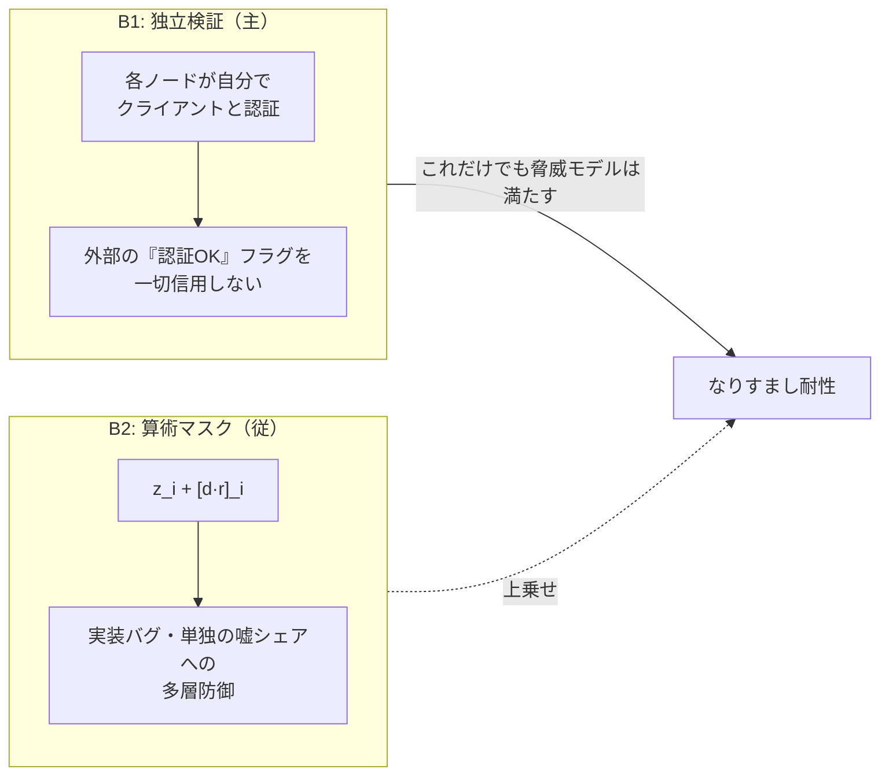
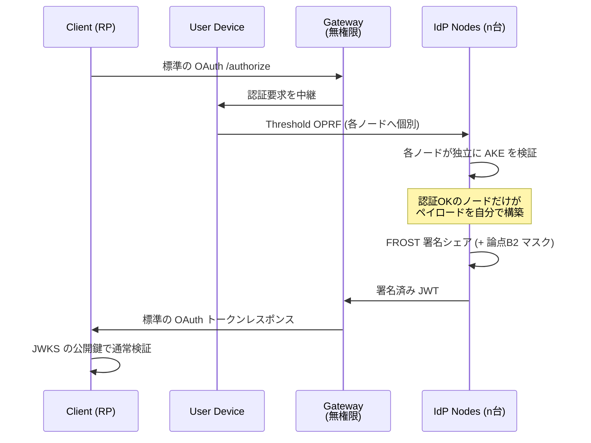

# 分散IdP: 論点整理と推奨構造

[Issue #81](https://github.com/zk-tokyo/advanced-cryptography-2026/issues/81)
**まだ決まっていない論点** ところ

> **⚠️ このドキュメントは先行研究調査の前に書いたもの。**
> [prior-art.md](./prior-art.md) で PASTA (CCS 2018) が同じ問題を既に解いていることが分かり、
> **論点B の結論が変わった**（MPC 回路による束縛は不要）。
> 実際に動く実装は [implementation.md](./implementation.md) を参照。

---

## 0. 合意できている前提

- 最上位の脅威は **なりすまし**。IdP を掌握した者が任意のユーザーとして全 RP で行動できる
- 派生する問題として、恣意的なサービス停止 と 利用履歴の集約 がある
- **認証だけの分散も、署名だけの分散も不十分**
  - パスワード照合を MPC 化しても、署名鍵が1箇所なら認証を飛ばして直接署名できる
  - 閾値署名だけ入れても、要求が来たら t 台が素直に署名するなら鍵分散の意味が消える
- したがって **認証成功と署名発火を束縛する** 必要がある

この最後の一点をどう実現するかが未決の中心。以下、論点ごとに分解する。

---

## 1. 論点の一覧

| # | 論点 | 推奨 | 難度 |
|:--|:-----|:-----|:-----|
| A | 認証を MPC でどうやるか | Threshold OPRF (OPAQUE系) | 中 |
| B | 認証と署名の束縛方式 | 各ノードの独立検証を主、算術マスクを従 | **高** |
| C | 閾値署名の方式と JWT の alg | FROST + EdDSA (Ed25519) | 中 |
| D | t ノードが同一バイト列に署名する決定性 | ペイロードをノード側で決定的に構築 | 中 |
| E | ゲートウェイの位置づけと OAuth 互換 | 暗号学的に無権限なゲートウェイ | 低 |
| F | トークンの持ち主束縛 | DPoP (`cnf.jkt`) | 低 |
| G | リフレッシュトークン | **束縛原則と正面衝突。要議論** | **高** |
| H | 登録とアカウント回復 | 未決。UX 上の最大の壁 | **高** |
| I | レート制限 | OPRF なら構造的に得られる | 低 |
| J | 結託耐性 | 後回し（Issue でもスコープ外扱い） | - |

難度「高」の B・G・H が本命の議論対象。C・D・E・F は選べば済む。

---

## 2. 論点B: 束縛をどう実現するか（本丸）

Issue 上で出た案は2つ。どちらか一方ではなく **役割が違う** ので、両方の位置づけを決めたい。

### 案B1: 各ノードが自分で認証を検証してから署名シェアを出す

ノード *i* は、自分自身がクライアントと行った認証プロトコルの成否だけを根拠に署名シェアを出す。
「認証OK」というフラグを外部（ゲートウェイや他ノード）から受け取ることは絶対にしない。

- 攻撃者がゲートウェイを掌握 → 各ノードが独自にクライアントと認証するので署名は出ない ✓
- 攻撃者が t 未満のノードを掌握 → 署名シェアが足りない ✓
- 攻撃者が t 以上を掌握 → 破れる（これは閾値署名の定義上避けられない）

### 案B2: 算術マスクで縛る（`f_role * (r-2)(r-5)(r-6) == 0` の発想）

認証の成否を表す秘密共有値 `d`（成功なら 0）と新しい乱数 `r` を使い、署名シェアを `z_i + [d·r]_i` にする。

- 認証成功 → `d = 0` なので `d·r = 0`、マスクの総和が 0 になり署名は正しい
- 認証失敗 → `d·r` は一様乱数、総和が乱数になり署名は壊れる
- `r` が毎回新鮮なので、失敗時に `d` の中身（＝どれだけ惜しかったか）は漏れない

`d·r` は共有値同士の乗算なので **Beaver triple が要る**。ここが既存コードの出番。

### 両者の関係（重要）

**B2 は B1 より強くない。** t 台掌握されれば B2 でも鍵も状態も再構成できるので、耐性は同じ。
B2 の価値は「ノードの実装バグや、悪意ある1台が嘘のシェアを出すこと」への多層防御であって、
主たる防御線は B1 側にある。

### さらに重要な原則

束縛の議論で見落としがちだが、これが抜けると B1 も B2 も無意味になる:

> **各ノードは JWT のペイロードを自分で構築する。渡されたペイロードに署名してはいけない。**

そうでないと、攻撃者が自分のアカウントで正規に認証を通し、署名直前に `sub` クレームを
他人の ID に差し替えるだけでなりすませる。認証で確かめた本人 ID と、
署名するペイロードの `sub` が、同じノードの中で繋がっている必要がある。

**議論したいこと:** B1 を主・B2 を従とする理解でよいか。B2 は MVP に入れるか、後追いか。

---

## 3. 論点A: 認証方式 — 素朴な MPC 一致判定か、Threshold OPRF か

Issue では「パスワードを分散保管し、分散的に一致判定する」とされていたが、
素朴にやると Threshold OPRF に対して不利になる点がある。

| | 素朴な MPC 一致判定 | Threshold OPRF (OPAQUE系) |
|:--|:--|:--|
| 保管するもの | `H(pw)` の共有 | OPRF 鍵の共有 + envelope |
| 照合 | 回路内で等値判定 | クライアント側で envelope を解錠、以後 AKE |
| **オフライン辞書攻撃** | t 台結託で **可能** | t 台結託で可能（同じ） |
| **オンライン辞書攻撃** | 各ノードが独立に試行回数を数える | **1回の推測に t ノードの応答が必須** |
| レート制限 | ノードごとにバラバラ、回避されうる | 1ノードが絞れば全体が止まる ✓ |
| 実装 | 自前 MPC | `facebook/opaque-ke` が使える |

決定的な差は **オンライン辞書攻撃のレート制限**（論点I と同じ話）。
OPRF は「1推測 = t ノードへのオンライン問い合わせ」が構造的に強制されるので、
どこか1ノードが試行を絞るだけで攻撃全体が止まる。素朴な一致判定にはこの性質がない。

**推奨:** 認証は Threshold OPRF ベース。ただし B2 の算術マスクを入れるなら、
「AKE が成功したか」を表す `d` を作る部分だけは MPC 回路に残る。

**議論したいこと:** MPC で照合すること自体が目的化していないか。
OPAQUE を採ると自前 MPC の出番が「束縛マスク」だけに縮むが、それでよいか。

---

## 4. 論点C: 署名方式

| | FROST (RFC 9591) | GG20 |
|:--|:--|:--|
| 曲線 / JWT の `alg` | Ed25519 → `EdDSA` (RFC 8037) | secp256k1 / P-256 → `ES256` |
| 署名ラウンド | 2ラウンド、**シェア計算は全てローカルの線形演算** | Paillier・range proof が絡み重い |
| 実装の重さ | 軽い | 重い。過去に脆弱性報告が複数 |
| RP 側の対応 | `EdDSA` は主要 JWT ライブラリで対応（**要確認**） | `ES256` は最も広く対応 |

**推奨: FROST + EdDSA。** 理由は実装の軽さと RFC 化済みであること。
`ES256` の互換性は魅力だが、GG20 の複雑さを学習プロジェクトで正しく実装するのは現実的でない。

> **注意:** FROST の署名シェアは `z_i = d_i + e_i·ρ_i + λ_i·s_i·c` で、**全てローカル計算＋線形**。
> 参加者間の乗算プロトコルが要らないので、**FROST 自体に Beaver triple は不要**。
> 既存の `beaver_triple.rs` / `mpc_arithmetic.rs` は署名ではなく、論点B2 のマスク生成に使うことになる。

**議論したいこと:** RP 側ライブラリの `EdDSA` 対応状況を実際に調べる担当を決めたい。

---

## 5. 論点D: ペイロードの決定性

見落とされやすいが実装で必ず詰まる。t ノードが **バイト単位で同一の** メッセージに署名しないと
署名は成立しない。以下を決定的にする必要がある。

- `iat` / `exp` — 各ノードのローカル時刻ではズレる。**リクエスト nonce から導出するか、一定量子に丸める**
- `jti` — 各ノードが乱数生成したら一致しない。**セッションのトランスクリプトのハッシュから導出**
- JSON のキー順・空白 — **正規化（RFC 8785 JCS 等）が必須**
- JWT ヘッダ (`alg` / `kid` / `typ`) も当然一致させる

**推奨:** 「署名対象バイト列は認証トランスクリプトから決定的に導出される」を設計の不変条件にする。
これは論点B の「ペイロードを自分で構築する」原則とも自然に噛み合う。

---

## 6. 論点E/F: OAuth 互換とトークン束縛

- **ゲートウェイは暗号学的に無権限。** 可用性の単一障害点ではあるが、掌握されても署名は出せない
- **RP から見れば普通の OIDC。** `/.well-known/openid-configuration` と JWKS を公開すれば、
  RP はグループ公開鍵で通常の署名検証をするだけ。閾値署名であることを知る必要すらない ← 互換性の最大の勝ち筋
- **DPoP (RFC 9449):** クライアントの一時鍵の thumbprint を `cnf.jkt` に入れる。
  盗まれたトークン単体では使えなくなり、「認証を突破した者 = トークンを使う者」が保証される

**議論したいこと:** OAuth のリダイレクト先 URL をどうするか。
ゲートウェイ1つに集約すると可用性の SPOF になるが、クライアント SDK が n ノードを直接叩く形にすると
「既存 IdP をそのまま置き換える」という当初目標から外れる。

---

## 7. 論点G: リフレッシュトークン（未解決・要議論）

**ここが設計上いちばん厄介。** リフレッシュトークンは定義上「パスワードなしで新しいアクセストークンを得る」
仕組みなので、「認証が通っていないと署名が発火しない」という原則と正面から衝突する。

素直に実装すると、リフレッシュトークンという新しい bearer credential が生まれ、
それを盗めばなりすませることになり、分散化の意味が減じる。

考えられる方向:

- **(a) リフレッシュも DPoP 束縛にする** — クライアント鍵の所持証明を各ノードが個別に検証してから
  署名シェアを出す。パスワードは不要だが「鍵の所持」という認証は残るので、B1 の原則は保たれる
- **(b) 各ノードが独立にセッション状態を持つ** — ステートフルだが失効が効く。分散環境での状態同期が課題
- **(c) リフレッシュを諦め、短命トークン + 都度再認証** — 最も安全だが UX が悪い

**推奨は (a) + (b) の組み合わせ**だが、これは要議論。

---

## 8. 論点H: 登録とアカウント回復（未解決・要議論）

集権 IdP なら「運営に問い合わせて本人確認」で回復できる。分散 IdP にはその窓口が存在しない。
パスワードを忘れた瞬間にアカウントが永久に失われるなら、実用にならない。

候補: ソーシャルリカバリ / 事前配布のリカバリシェア / 複数デバイス鍵での回復。
いずれも「回復経路が新しいなりすまし経路にならないか」を同じ厳しさで検証する必要がある。

**Issue でまだ一度も触れられていない論点。** 早めに俎上に載せたい。

---

## 9. 既存コードの棚卸し

`beaver-triple-mpc` (803行) を上記の構造に当てるとこうなる。

| ファイル | 現状 | 今後 |
|:--|:--|:--|
| `field.rs` | `GF(2^61-1)`（Mersenne 素数） | ⚠️ **Ed25519 のスカラー体 ℓ ≈ 2^252 ではない。** 署名絡みの算術を MPC でやるなら体の変更が必要 |
| `oblivious_transfer.rs` / `gilboa.rs` | OT と Gilboa 乗算 | Beaver triple 生成に継続利用 |
| `beaver_triple.rs` | triple 生成 | **論点B2 のマスク `d·r` 生成に使う。FROST 署名自体には不要** |
| `mpc_arithmetic.rs` | 加算・乗算ゲート | 同上 |
| `node_connection.rs` | 3ノードのリング状 TCP | ⚠️ **加法的分散で t = n = 3。閾値 (t < n) ではないので1台落ちたら止まる。** FROST は Shamir 分散が前提 |

つまり既存コードは **捨てる必要はないが、主役ではない**。
FROST の署名パスには使わず、論点B2 を採用する場合の束縛マスク生成器として活きる。

---

## 10. 次に議論したいことの優先順位

1. **論点B** — B1 主 / B2 従 という整理でよいか。B2 は MVP に入れるか
2. **論点A** — OPAQUE を採って自前 MPC の出番が縮むことを受け入れるか
3. **論点G・H** — リフレッシュと回復。今のうちに方向だけでも決めたい
4. **論点C** — FROST + EdDSA で確定してよいか（RP 側の `EdDSA` 対応調査が必要）

---

## 参考文献

| 分野 | 論文 / 仕様 |
|:-----|:---------|
| 認証の分散化 | [OPAQUE (RFC 9807)](https://www.rfc-editor.org/rfc/rfc9807.html), [Cloudflare解説](https://blog.cloudflare.com/opaque-oblivious-passwords/), [Threshold OPRF (eprint 2017/363)](https://eprint.iacr.org/2017/363.pdf) |
| 閾値署名 | [FROST (RFC 9591)](https://www.rfc-editor.org/rfc/rfc9591.html), [GG20 (eprint 2020/1390)](https://eprint.iacr.org/2020/1390.pdf) |
| セッション束縛 | [DPoP (RFC 9449)](https://datatracker.ietf.org/doc/html/rfc9449) |
| JOSE の EdDSA | [RFC 8037](https://www.rfc-editor.org/rfc/rfc8037.html), [JWK Thumbprint (RFC 7638)](https://www.rfc-editor.org/rfc/rfc7638.html) |
| JSON 正規化 | [JCS (RFC 8785)](https://www.rfc-editor.org/rfc/rfc8785.html) |
| 実装 | `facebook/opaque-ke` (Rust), `ZcashFoundation/frost` (Rust), `bnb-chain/tss-lib` (Go) |
