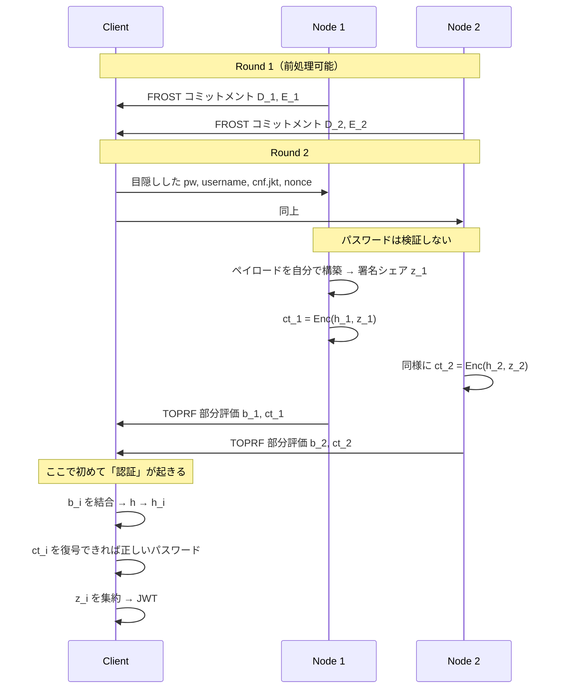
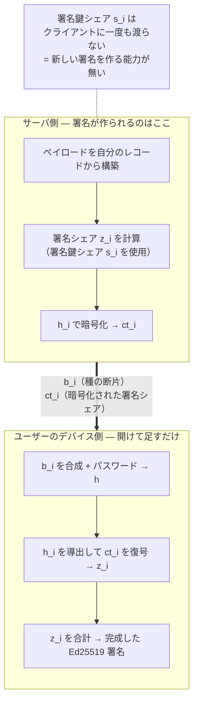

# 実装: PASTA 方式の分散 IdP (PoC)

[prior-art.md](./prior-art.md) の調査結果にもとづく実装。
**3 ノード / 閾値 2 で、パスワード認証からアクセストークン発行までが通る。**


## 動かす

```sh
cargo test --lib --test pasta_integration        # 28 テスト
cargo run --bin pasta_demo                       # 1 回 sign-on して JWT を出す

# 出したトークンを独立した標準 Ed25519 検証器で検証する
cargo run --bin pasta_demo | python3 scripts/verify_token.py
```

## いちばん重要な検証結果

**どのノードも署名鍵を持っていないのに、出てきた JWT は普通の Ed25519 検証器で通る。**

`scripts/verify_token.py` は Python の `cryptography` (OpenSSL 系) と PyNaCl (libsodium) で
検証しており、**IdP 側の実装を一切共有していない**。つまり RP 側は閾値署名であることを
知る必要すらなく、`alg: EdDSA` の JWT として普通に扱える。

```json
{
  "iss": "https://idp.example",
  "sub": "alice",
  "aud": "https://rp.example",
  "iat": 1787376420,
  "exp": 1787376720,
  "jti": "63ff63018c3813c727507f13c1aba2f1",
  "cnf": { "jkt": "0ZcOCORZNYy-DWpqq30jZyJGHTN0d2HglBV3uiguA4I" }
}
```

これが Issue #81 の「既存の集権的 IdP をそのまま置き換える」という目標に対する答えになる。

## モジュール構成

| ファイル | 内容 |
|:--|:--|
| `src/pasta/shamir.rs` | Ed25519 スカラー体上の Shamir 秘密分散、ラグランジュ係数 |
| `src/pasta/toprf.rs` | 2HashTDH 閾値 OPRF (Ristretto255)。h と h_i の導出 |
| `src/pasta/tsign.rs` | FROST 方式の閾値 Schnorr 署名。出力は標準 Ed25519 署名 |
| `src/pasta/jwt.rs` | 決定的な JWT 構築。base64url、固定キー順 JSON |
| `src/pasta/protocol.rs` | 登録と sign-on。**束縛はここ** |
| `tests/pasta_integration.rs` | 脅威モデルの各経路を塞げていることの実証 |
| `src/bin/pasta_demo.rs` | 3 ノードのデモ |
| `scripts/verify_token.py` | 独立した標準検証器での確認 |

既存の `src/{field,beaver_triple,gilboa,oblivious_transfer,mpc_arithmetic,node_connection}.rs`
には手を触れていない。PASTA 方式では MPC 回路が不要なので依存関係も無い。

## 束縛のからくり



**サーバは一度もパスワードを検証していない。** 認証は「クライアントが復号できたか」として現れる。

## 誰が何をしているのか — 役割の整理

「クライアントがパスワードと種をこねてトークンを出しているなら、クライアントが認証サーバに
なっているのでは？」という疑問が出やすいので整理しておく。**半分正解で、決定的な違いが1つある。**

### クライアントは署名を作れない



各サーバから返るのは2つだけ。

| 受け取るもの | 中身 |
|:--|:--|
| `b_i` | TOPRF の部分評価。「種」の断片にあたる |
| `ct_i` | **サーバが既に作った署名シェア**を暗号化したもの |

**`z_i` を計算したのはサーバであって、クライアントではない。** クライアントは署名鍵シェア `s_i` を
一度も見ないので、新しい署名を作る能力を持たない。`sub: bob` のトークンは、
サーバが bob のペイロードに署名しない限り存在しないし、そのためには bob のパスワードが要る。

役割で言えば、**クライアントは署名者ではなく集約者 (aggregator)**。
FROST でいう coordinator の位置にいる。

### 「クライアント」という語の衝突に注意

OAuth の用語と混ざりやすい。

| | 誰か | この処理に参加するか |
|:--|:--|:--|
| OAuth の **Client** | RP（サービス側のアプリ） | **参加しない。** 標準の JWT を受け取るだけ |
| ここでの「クライアント」 | **ユーザーのデバイス**（ブラウザ / アプリ） | 集約する本人 |

RP が認証サーバになるわけではない。RP から見た形式は完全に標準のまま。

### OAuth プロキシは「中継者」にはできる（「集約者」にはできない）

ユーザーのデバイスが t 台のサーバと**論理的に**やり取りする必要はあるが、
**ネットワーク的に t 本の接続を張る必要は無い**。単一の OAuth エンドポイント
（＝ OAuth プロキシ）で多重化してよい。

理由は PASTA の暗号化そのもの。サーバが返す `ct_i` は `h_i` で暗号化されていて、
**パスワードを知らないプロキシには開けない**。

| プロキシにできること | 可否 | 理由 |
|:--|:--:|:--|
| トークンを偽造する | ❌ | 署名鍵シェア `s_i` を持たない |
| トークンを盗み見る | ❌ | `ct_i` を復号できない（`h_i` が要る = パスワードが要る） |
| 可用性を壊す | ⭕️ | ゴミを返せば DoS になる。ただし検知はできる |
| 誰がログインしたか観測する | ⭕️ | `sub` は見える。**サーバも同じものを見るので追加の損失は無い** |

つまりプロキシの脅威は**可用性とプライバシ**であって、**不可分性ではない**。
プロキシを信頼境界の外に置いたまま、RP から見た OAuth のネットワーク形状を
1ミリも変えずに閾値化できる — これが論点E の答えになる。

集約（Lagrange 補間と `ct_i` の復号）だけは**ユーザーのデバイスから動かせない**。

### `h` は誰も知らない

「サーバから種をもらう」という表現は少しずれていて、**`h` を知っているサーバは1台も無い**。

- 1台では TOPRF を計算できない（t 台の部分評価が必要）
- 登録時にサーバ *i* が受け取るのは `h_i = H'(h, i)` だけで、`h` そのものは渡らない

正確には「**t 台の断片を集めて、パスワードを混ぜて初めて種ができる**」。
これが PASTA の client impersonation 対策であり、1台侵害しても他の `h_j` が手に入らない理由。

### 悪意あるクライアントが「検証を飛ばす」とどうなるか

何も起きない。ここが PASTA のいちばんきれいなところで、

> クライアント側の検証は **「if (パスワードOK) then 進む」という関門ではなく、
> 「鍵が無ければ物理的に開かない」という能力**。

飛ばそうが何をしようが、正しい `h` が無ければ `ct_i` は復号できない。
だから検証をクライアント側に置いても安全性が落ちず、PASTA は4ラウンドを2ラウンドに縮められた。

## テストで実証していること

`cargo test --test pasta_integration` の 14 本が、脅威モデルの各経路に対応している。

| テスト | 塞いでいる経路 |
|:--|:--|
| `correct_password_yields_token_verifiable_by_rp` | 正常系。RP が検証できる |
| `servers_emit_shares_without_verifying_password` | サーバが検証していないことの確認（PASTA の要） |
| `wrong_password_yields_no_token` | パスワードを知らなければトークンにならない |
| `below_threshold_yields_no_token` | t 未満では不可 |
| `breaching_one_server_does_not_allow_forgery` | **1 台掌握してもなりすませない** |
| `shares_cannot_be_replayed_across_sessions` | 署名シェアの別セッションへの流用 |
| `preprocessed_nonce_is_single_use` | ノンス再利用（Schnorr の鍵漏洩に直結） |
| `subject_comes_from_server_record` | **`sub` の差し替え**（論点B の原則） |
| `token_is_bound_to_dpop_key` | トークン盗難（DPoP 束縛） |
| `all_servers_sign_byte_identical_payload` | ペイロードの決定性（論点D） |
| `commitment_set_must_be_complete` | FROST の参加者集合の完全性 |
| `tampered_token_is_rejected` | トークン改竄 |
| `any_quorum_yields_valid_token` | どの quorum でも同じ公開鍵で通る |
| `header_declares_standard_eddsa` | `alg: EdDSA` である |

## 実装して分かったこと


### 1. 時刻の量子化だけでは決定性は得られない

`iat` を 30 秒に丸めれば時計ズレを吸収できると考えていたが、**間違い**。
バケット境界をまたぐと、29 秒差でも別の値になる。

```rust
assert_ne!(quantize_time(1_700_000_000), quantize_time(1_700_000_029));
```

正しい構造は「**トランスクリプト中の 1 つの値を全ノードが使う**」。
本実装ではクライアントが提案した `iat` を全サーバが採用し、
各サーバは自分の時計を **許容範囲の検査にだけ** 使う。
（`src/pasta/jwt.rs` の `quantization_alone_does_not_absorb_skew` テストに記録した）

### 2. FROST の t-of-n は「セッション開始後の脱落耐性」ではない

R と λ_i は署名パッケージに載った参加者集合**全体**で決まるので、
3 台がコミットしたセッションで 2 枚だけ集めても署名は成立しない。

t-of-n が与えるのは **どの quorum を選ぶかの自由** であって、
コミット後に 1 台落ちたらセッションごとやり直すことになる。
可用性設計では「コミットメントを多めに集めておく」等の工夫が要る。

### 3. `frost-ed25519` クレートは使えなかった

`frost-ed25519 3.0.0` は `curve25519-dalek = 4.1.3` を**完全一致**で要求するが、
本リポジトリは dalek 5.0.0 を使っている。共存はできるが型が相互運用できない。

そのため FROST を dalek 5.0 上に自前実装した（`tsign.rs`, 約 190 行）。
**署名シェア `z_i = d_i + ρ_i·e_i + λ_i·s_i·c` は全てローカル
の線形演算**なので、
参加者間の乗算プロトコルは不要 ＝ Beaver triple は 1 度も使っていない。

本番化するなら dalek を 4.1.3 に落として `frost-ed25519` を使うべき。
自前実装の暗号を運用する理由は無い。

### 4. AEAD の AAD が効く

署名シェアを暗号化する際、AAD に署名対象そのものを入れておくと、
シェアを別セッションに流用する攻撃が自動的に潰れる。PASTA 論文には明示が無いが、
実装上ほぼコストゼロで得られる。

## 未実装

論点のうち、手つかずのもの。全体の到達度は [status.md](./status.md) を参照。

- **論点G: リフレッシュトークン** — 設計は決まった（[refresh-token.md](./refresh-token.md)）。
  OAuth を壊さず実装できる見込み。実装はこれから
- **論点H: アカウント回復** — マイナ/JPKI 等の別の鍵生成経路を足す方針。実装はこれから
- **論点E: ネットワーク層** — 本 PoC はサーバをプロセス内の構造体として持っている。
  既存の `node_connection.rs` のような TCP 層と、OAuth ゲートウェイは未実装
- **DKG** — 署名鍵を trusted dealer (`tsign::generate_key`) で作っている。
  本来は分散鍵生成にして、生成時点でも鍵が揃わないようにすべき
- **Proactive secret sharing** — PESTO の核心部分。未実装
- **レート制限** — TOPRF がオンライン攻撃を強制する構造は得ているが、
  各ノードでの試行回数の制限は未実装
