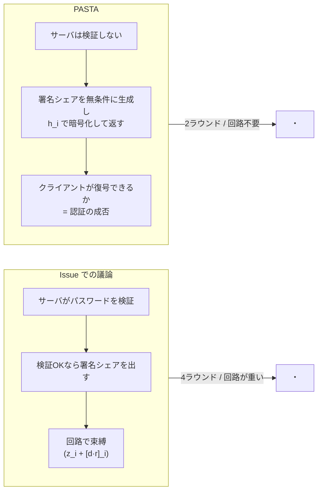

# 先行研究調査と実装可能性の検証

[Issue #81](https://github.com/zk-tokyo/advanced-cryptography-2026/issues/81) の設計に入る前に、
同じ問題を扱った先行研究と、実際に使えるコードを調べた結果。

**結論を先に:** 私たちが議論していた問題は、**PASTA (CCS 2018)** で既に定式化・実装・証明されている。
しかも解き方が議論の方向とは違う。先にこれを読むべき。

---

## 1. PASTA — この Issue とほぼ同一のテーマの先行研究

[PASTA: PASsword-based Threshold Authentication](https://eprint.iacr.org/2018/885)
(Agrawal, Miao, Mohassel, Mukherjee — ACM CCS 2018)

> Token-based authentication is commonly used to enable a single-sign-on experience ... clients sign on to
> an identity provider using their username/password to obtain a cryptographic token generated with a master
> secret key. **The authentication server(s) are single point of failures that if breached, enable attackers
> to forge arbitrary tokens or mount offline dictionary attacks to recover client credentials.**

Issue の問題意識（なりすまし = トークン偽造）と一字一句同じ。
PASTA は **PbTA (Password-based Threshold Authentication)** という概念を定式化し、
IdP の役割を n サーバに分散、任意の t サーバが協力すればパスワード検証とトークン発行ができ、
t−1 サーバでは **トークン偽造もオフライン辞書攻撃も不可能** という枠組みを与えた。

安全性は2つの性質として定義されている:

- **Unforgeability** — トークンを偽造できない（＝なりすまし不可）
- **Password-Safety** — オフライン辞書攻撃が効かない

### PASTA の解き方は、私たちの議論と違う

Issue では「認証と署名をひとつの MPC 回路として束縛する」方向で議論していた。
PASTA の答えはもっと軽い。論文の技術概要から:

> We resolve this deadlock by observing that **the check does not have to be done on the server side.**
> Instead of checking the secret information and then participating in the TTG scheme to generate token
> shares, **the servers generate token shares directly and encrypt them under the secret information `h`
> using a symmetric-key encryption scheme.** ... Now the protocol only has two rounds, and **the check is
> done on the client side**: only if the client has used the correct password in the first round of TOPRF
> can it calculate the correct `h` and decrypt the ciphertexts to obtain `t` token shares, and combine
> them to recover the final token.

つまり **サーバはパスワードを検証しない。** 無条件に署名シェアを作り、
それをパスワード由来の鍵で暗号化して返す。正しいパスワードを持つ者だけが復号して結合できる。

「認証が通っていないと署名が発火しない」を、**発火の制御ではなく復号の可否**として実現している。
これなら署名計算を MPC 回路に押し込む必要がない。

### PASTA が潰している3つの落とし穴

素朴に組むと踏む罠が、論文中で順に潰されている。私たちも同じ罠を踏むところだった。

1. **保存する秘密情報を `H(pw)` にしてはいけない**
   パスワードだけから計算できてしまうので、1台侵害でオフライン辞書攻撃が成立する。
   秘密情報をサーバ側の秘密にも依存させる必要があり、そのための道具が **Threshold OPRF**。
   `h = F_k(password)` を秘密情報とする。t 台の協力なしには誰も計算できない。

2. **`h` をそのままサーバに保存してはいけない**（client impersonation attack）
   1台侵害して `h` を得た攻撃者は、パスワードを知らないまま sign-on に参加し、
   返ってきた暗号文を全部復号してトークンを組み立てられてしまう。
   対策として、クライアントは登録時に **`h_i = H'(h, i)` をサーバ *i* にだけ送る**。
   `h` そのものはどのサーバにも渡らない。侵害されても他サーバ分の `h_i` は秘密のまま。

3. **TOPRF 鍵を全クライアントで共有してはいけない**（multi-client security）
   1人のクライアントに対する総当たりで全パスワードの PRF 値を集めると、
   他クライアントの暗号文をオフラインで試行できてしまう。
   対策は **クライアントごとに TOPRF 鍵を生成し、登録時にサーバ間で秘密分散する**。

### 性能

論文の実測では、単一サーバ方式に対する **オーバーヘッドはインターネット環境で 1〜5%**。
「分散したら遅くて使い物にならない」という直感は否定されている。

また **対称鍵だけの解は不可能であることが証明されている**（公開鍵演算が必須）。
つまり閾値署名を避けて MAC だけで済ませる道は原理的に無い。

---

## 2. PESTO — PASTA の改良版

[PESTO: Proactively Secure Distributed Single Sign-On, or How to Trust a Hacked Server](https://eprint.iacr.org/2019/1470)
(Baum, Frederiksen, Hesse, Lehmann, Yanai — IEEE EuroS&P 2020)

PASTA を改良し、**proactive security** と **adaptive security** を追加、UC フレームワークで証明。

- **全サーバが同時に侵害されない限り安全** — 順次侵害されても、鍵を再シェアすることで
  過去に漏れた情報を無効化できる
- Issue の「スコープ外」に挙げていた **Proactive Secret Sharing** が、
  ここでは中心的な機構として組み込まれている

Issue で「結託耐性は最後に考えたほうがいい」としていた論点に、既に答えがある。

---

## 3. 隣接プロダクトとの違い（重要）

Issue のコメントで zkLogin / Web3Auth 系が挙がったが、**解いている問題の層が違う**。

| | 何をしているか | なりすまし問題を解くか |
|:--|:--|:--|
| **zkLogin (Sui)** | OAuth の `id_token` を ZKP でブロックチェーンアドレスに紐付け | ❌ OAuth プロバイダを**信頼する前提**。IdP が偽 `id_token` を出せば終わり |
| **Web3Auth / tKey** | OAuth ログイン結果を鍵シェアに変換、Shamir + TSS で分散管理 | ❌ 同上。`idToken` を Auth Network に渡す構造なので、IdP は依然として信頼点 |
| **Lit Protocol** | 閾値ネットワークで PKP を管理 | △ 鍵管理は分散だが、認証入力は外部 IdP |
| **PASTA / PESTO** | **IdP そのものを分散する** | ✅ これが Issue のテーマ |

Web3Auth の既定構成は Auth Network 3/5、ユーザーデバイス側 2/3 の閾値。
分散鍵管理の実運用パラメータとして参考になるが、**OAuth を信頼された入力として受け取っている**点で、
私たちが解こうとしている問題の外側にいる。

Takumi さんの Issue でのコメント（「OAuth の結果を web3 アカウントに繋げようというものに見えた」）は正しい。

---

## 4. 使える実装の実地調査

`crates.io` の実データで確認した結果。

| クレート | 最新版 | DL数 | 用途 |
|:--|:--|:--|:--|
| `frost-ed25519` | 3.0.0 | 352k | FROST 閾値 Schnorr (Ed25519) |
| `frost-core` | 3.0.0 | 709k | 同上のコア |
| `opaque-ke` | 4.0.1 | 568k | OPAQUE PAKE (facebook) |
| `jsonwebtoken` | 11.0.0 | 173M | JWT |

### ⚠ 依存バージョンの衝突を発見

本リポジトリと `frost-ed25519 3.0.0` の依存は噛み合わない。

| | 本リポジトリ | `frost-ed25519 3.0.0` が要求 |
|:--|:--|:--|
| `curve25519-dalek` | **5.0.0** | **`=4.1.3`（完全一致指定）** |
| `rand_core` | 0.10.1 | `^0.6` |
| `sha2` | 0.11.0 | `^0.10.2` |

Cargo はメジャー版違いを共存させられるのでビルドは通るが、**型は相互運用できない**。
dalek 5.0 の `Scalar` と 4.1.3 の `Scalar` は別の型なので、TOPRF 側と FROST 側で
バイト列を介した変換が必要になる。RNG も `rand_core 0.6` の `RngCore` を実装したシムが要る。

**選択肢:**

- **(a) `frost-ed25519` を使い、シムと型変換を書く** — 実績あるコードを使えるが、
  同じ曲線ライブラリが2バージョン同居する
- **(b) FROST を dalek 5.0 上に自前実装する** — 依存が綺麗に揃い TOPRF と型を共有できる。
  RFC 9591 の Ed25519 ciphersuite は `c = SHA512(R ‖ A ‖ M)` なので、
  **標準の Ed25519 検証器でそのまま検証できる**（＝ JWT の `alg: EdDSA` 互換）。
  ただし自前実装の暗号なので教育用途限定

### PASTA を FROST で組む場合の注意

PASTA が TTG として実装したのは **ブロック暗号 MAC / DDH-MAC / ペアリング署名 (Boldyreva) / RSA 署名 (Shoup)** の4種で、
**FROST は含まれない**（PASTA は2018年、FROST は2020年）。

ここに構造的な差がある。

- **BLS 系はシェア生成が非対話**（`σ_i = H(m)^{sk_i}` を各サーバが独立に計算）なので
  PASTA の2ラウンド構造に完璧に嵌る。しかし **JOSE に BLS の標準 `alg` が無い** → RP 互換性を失う
- **FROST は round1 のコミットメントを参加者間で共有する必要がある** ので、
  そのままでは PASTA の2ラウンドに収まらない。ただし **FROST は round1 の前処理が可能**なので、
  コミットメントを事前に配っておけば sign-on 自体は2ラウンドで回る

Issue の目標が「既存の集権的 IdP をそのまま置き換える」である以上、
**RP 互換性を取って FROST + EdDSA、round1 は前処理**、が妥当な選択と考える。

---

## 5. 設計への反映

先行研究を踏まえた、各論点への回答。到達度は [status.md](./status.md) を参照。

| 論点 | 調査前の推奨 | 調査後 |
|:--|:--|:--|
| A: 認証方式 | Threshold OPRF | **変更なし。** PASTA も 2HashTDH TOPRF を使用。ただし**クライアントごとに TOPRF 鍵**が必須 |
| B: 束縛方式 | B1 主 / B2 従 | **B2 (算術マスク) は不要。** PASTA の「暗号化して返し、クライアント側で復号」で足りる。回路が消える |
| C: 署名方式 | FROST + EdDSA | **変更なし。** ただし PASTA には FROST 版が無いので、round1 前処理の扱いは自分で設計する必要あり |
| G: リフレッシュ | 未解決 | PASTA/PESTO も扱っていない。**引き続き未解決** |
| H: 回復 | 未解決 | 同上。**引き続き未解決** |
| J: 結託耐性 | 後回し | **PESTO の proactive secret sharing に答えがある** |

**→ この方針で実装し、動作を確認した。[implementation.md](./implementation.md) を参照。**

**いちばん大きな変更は論点B。** 「認証と署名をひとつの MPC 回路に束縛する」という
議論の到達点は、PASTA の暗号化アプローチで置き換えられる。
既存の Beaver triple 実装の出番はここで無くなる（回路が要らないので）。

---

## 参考文献

| 分野 | 文献 |
|:--|:--|
| **本命** | [PASTA (eprint 2018/885, CCS'18)](https://eprint.iacr.org/2018/885) |
| **本命** | [PESTO (eprint 2019/1470, EuroS&P'20)](https://eprint.iacr.org/2019/1470) |
| パスワード更新 | [PAS-TA-U (SPACE 2020)](https://dl.acm.org/doi/10.1007/978-3-030-66626-2_2) |
| TOPRF | [Jarecki et al. 2HashTDH (eprint 2017/363)](https://eprint.iacr.org/2017/363.pdf) |
| PAKE | [OPAQUE (RFC 9807)](https://www.rfc-editor.org/rfc/rfc9807.html) |
| 閾値署名 | [FROST (RFC 9591)](https://www.rfc-editor.org/rfc/rfc9591.html) |
| セッション束縛 | [DPoP (RFC 9449)](https://datatracker.ietf.org/doc/html/rfc9449) |
| 隣接実装 | [Web3Auth 技術アーキテクチャ](https://web3auth.io/docs/overview/key-management/technical-architecture/), [MetaMask/tkey](https://github.com/MetaMask/tkey) |
