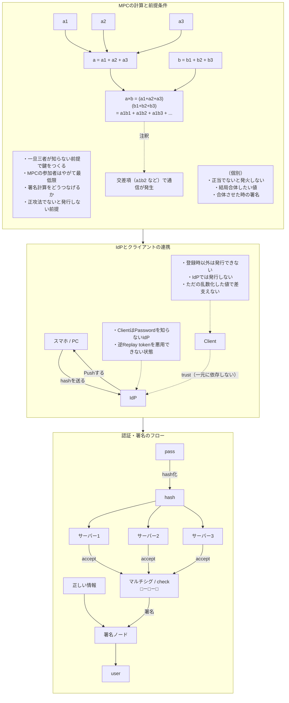

# 分散IdP 設計メモ

[zk-tokyo/advanced-cryptography-2026#81](https://github.com/zk-tokyo/advanced-cryptography-2026/issues/81) の議論の整理版。

| ドキュメント | 内容 |
|:--|:--|
| このファイル | 議論の整理と背景 |
| [design-discussion.md](./design-discussion.md) | 未決の論点 A〜J と構造案 |
| [prior-art.md](./prior-art.md) | **先行研究 (PASTA / PESTO) の調査**。設計方針が変わった |
| [implementation.md](./implementation.md) | **動く PoC**。3 ノード t=2 で JWT 発行まで通る |
| [status.md](./status.md) | **進捗と残論点**。どこまで作ったか / 何が残っているか |

## 何を解こうとしているか

最上位の脅威は **なりすまし**。IdP が乗っ取られる（あるいは運営者が悪意を持つ）と、任意のユーザーとして
あらゆる RP で行動できてしまう。「あなたは確かにユーザーAです」と認定する権限と、それを第三者に証明する
アクセストークンを発行する権限が、どちらも単一主体に集中していることが原因。

派生する問題として、

1. 恣意的なサービス停止 — 運営者の一存で全サービスから締め出せる
2. 利用履歴の集約 — 全リクエストが1箇所を通るので、いつ・どのサービスを使ったかが丸見え

がある。いずれも「権限の一点集中」という同じ根に由来する。

## 設計上の要点

**認証だけ分散しても、署名だけ分散してもダメ。**

- パスワード照合を MPC 化しても、JWT 署名鍵が1箇所にあれば認証を飛ばして直接署名できてしまう
- 逆に閾値署名だけ入れても、署名要求が来たら t 台が素直に署名する作りなら鍵を分散した意味がほぼ消える

したがって最低限、次の2つが同時に必要になる。

1. 署名鍵がどこにも揃っていない（閾値署名: FROST / GG20）
2. 認証が通っていないと署名が発火しない

2 が難しいところで、**認証と署名発行をひとつの MPC 回路として束縛する**のが方針。
week1 の回路で言えば `f_role` と `role` を別々に置くのではなく、
`f_role * (r-2)(r-5)(r-6) == 0` の形にまとめるのと同じ発想。
各ノードが「今回の認証は通った」を自分で確信したうえでのみ署名シェアを出す状態にしたい。

認証 MPC と閾値署名を別サービスにして API で繋ぐと、その隙間が必ず攻撃面になる。

## MPC / マルチシグ認証フロー



## 想定するリクエストフロー

OAuth / OIDC のプロトコルは維持したいので、OAuth server 自体は存在させる。
ただしパスワードに関する知識には一切介入させず、MPC への取次だけを担わせる。

```
client -> OAuth server -> MPC (パスワード認証 + アクセストークン署名)
                       <- 署名済み JWT
```

MPC から返ってきたアクセストークンを client に渡すにあたっては、DPoP のような仕組みで
トークン単体では悪用できない状態にする（認証を突破した者とトークンを使う者を一致させる）。

## 参考文献

| 分野 | 論文 / 仕様 |
|:-----|:---------|
| 認証の分散化 | [OPAQUE (RFC 9807)](https://www.rfc-editor.org/rfc/rfc9807.html), [Cloudflare解説](https://blog.cloudflare.com/opaque-oblivious-passwords/), [Threshold OPRF (eprint 2017/363)](https://eprint.iacr.org/2017/363.pdf) |
| 閾値署名 | [FROST (RFC 9591)](https://www.rfc-editor.org/rfc/rfc9591.html), [GG20 (eprint 2020/1390)](https://eprint.iacr.org/2020/1390.pdf) |
| セッション束縛 | [DPoP (RFC 9449)](https://datatracker.ietf.org/doc/html/rfc9449) |
| 関連する考え方 | [SIOPv2](https://openid.net/specs/openid-connect-self-issued-v2-1_0.html), [OpenID4VP](https://openid.net/specs/openid-4-verifiable-presentations-1_0.html) |
| 実装 | `facebook/opaque-ke` (Rust), `taurushq-io/frost-ed25519` (Go), `bnb-chain/tss-lib` (Go) |

## スコープ外（ただし要検討）

分散させてもノード運営者が結託すれば集権と同じになる、という点。対策の方向性としては、

- **運営者の多様性** — 異なる法域の組織、競合関係にある組織、DAO などコミュニティノードを混ぜる
- **検知可能性** — ノード間通信ログの公開、ZKP による検証可能な計算
- **インセンティブ設計** — ステーキング / スラッシング、レピュテーション（共謀のコスト > 共謀の利益）
- **技術的制約** — Proactive Secret Sharing でシェアを定期更新し結託の時間窓を狭める、閾値の引き上げ

運営コストとユーザー無料の両立をどうするか（RP がノードを運営する / 暗号経済的インセンティブ /
公共財として運営する / それらのハイブリッド）も併せて要検討。
