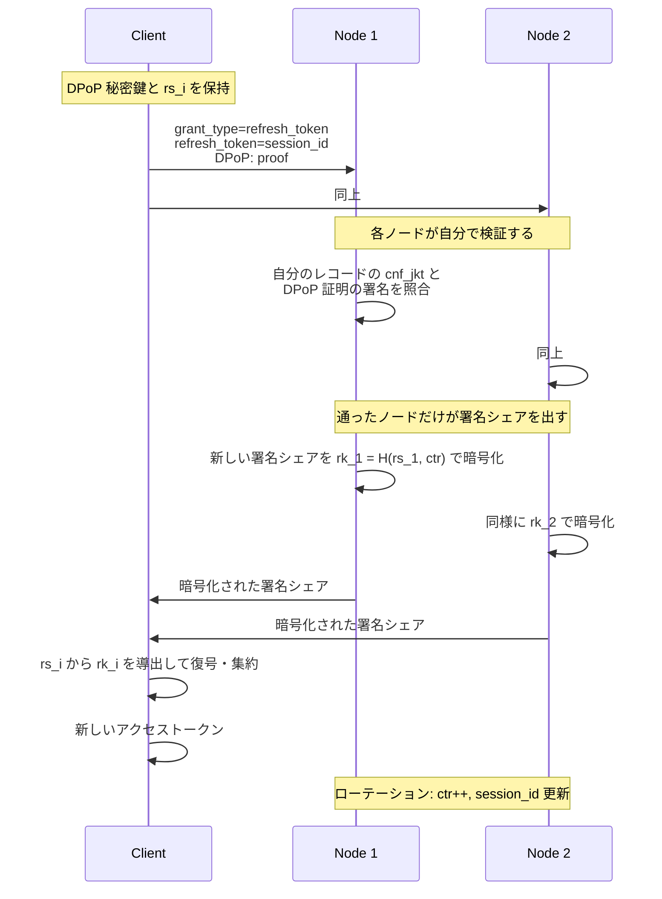

# 論点G: リフレッシュトークンは OAuth を壊さずに実装できるか

**結論: できる。** しかも仕様が明示的に許可している。

---

## 1. なぜ壊れないのか — 根拠は3つ

### ① リフレッシュトークンは仕様上 opaque

OAuth はリフレッシュトークンの**中身を一切規定していない**。クライアントにとっては
「保存して送り返す不透明な文字列」でしかない。したがって内部構造は自由に設計できる。

### ② RFC 9449 が「束縛の実装は認可サーバの裁量」と明記している

[RFC 9449](https://www.rfc-editor.org/rfc/rfc9449.html) §5 より:

> When an authorization server supporting DPoP issues a refresh token to a public client
> that presents a valid DPoP proof at the token endpoint, the refresh token **MUST** be
> bound to the respective public key.
>
> **The implementation details of the binding of the refresh token are at the discretion
> of the authorization server.**

つまり「DPoP 公開鍵に束縛せよ」は必須だが、**どう束縛するかは我々が決めてよい**。
分散 IdP 固有の仕組みを入れる余地が、標準の側に最初から空いている。

### ③ リクエストの形が変わらない

```http
POST /token
DPoP: <proof JWT>

grant_type=refresh_token&client_id=...&refresh_token=<opaque>
```

これは標準そのもの。RP から見て何も変わらない。

さらに [RFC 9700](https://www.rfc-editor.org/rfc/rfc9700.html)（OAuth 2.0 Security BCP, 2025年1月）§4.14 は
public client のリフレッシュトークンに **sender-constrained かローテーションのいずれかを必須**としている。
我々は両方やるので、標準より強い側に倒れる。

---

## 2. 設計 — 「解錠鍵の供給源」を差し替えるだけ

PASTA の構造は突き詰めると **「サーバは、正しい相手だけが導ける鍵でシェアを暗号化する」** の一点。
パスワードはその鍵の供給源の**一例**にすぎない。ここを差し替えれば refresh も recovery も同じ枠に入る。

| フェーズ | 解錠鍵の供給源 | 各ノードが自分で検証するもの |
|:--|:--|:--|
| sign-on | パスワード → TOPRF → `h_i` | （検証しない。復号可否が認証そのもの） |
| **refresh** | sign-on 時に配った `rs_i` | **DPoP 証明の署名** |
| recovery | マイナ/JPKI 等の別経路 | 署名 + 証明書チェーン |

**refresh と recovery は同型** — どちらも「各ノードが独立に公開鍵署名を検証する」だけ。
新しい暗号プリミティブは要らない。

### sign-on 時に仕込むもの

1. サーバ *i* は署名シェアに加えて、セッション秘密 `rs_i` を**同じ暗号文に同梱**する
   （`h_i` で暗号化されているので、**パスワードを通した者だけが `rs_i` を得る**）
2. サーバ *i* はセッションレコードを保存: `(session_id, cnf_jkt, rs_i, exp, ctr)`
3. クライアントに渡すリフレッシュトークンは **`session_id` という不透明文字列だけ**

### refresh 時



DPoP 証明の検証は**ただの公開鍵署名検証**なので、閾値プロトコルは要らない。
各ノードが単独で完結でき、**外部の「認証OK」フラグを信用しない**という原則が保たれる。

---

## 3. なぜこれで安全か

| 攻撃 | 結果 |
|:--|:--|
| リフレッシュトークン単体を盗む | ❌ 無意味。**DPoP 秘密鍵**と**`rs_i`**の両方が必要で、どちらもトークンに入っていない |
| ノードを1台掌握 | ❌ その台の `rs_i` しか得られず、他ノードの暗号文は開けない |
| ゲートウェイを掌握 | ❌ 各ノードが自分で DPoP を検証するので素通りできない |
| 古いリフレッシュトークンを再利用 | ❌ ローテーションで検知 → セッションごと失効（RFC 9700 §4.14） |
| t 台を掌握 | ⭕ 破れる（閾値署名の定義上避けられない） |

sign-on と同じ脅威モデルを維持できている。

---

## 4. 正直なところ、何が弱くなるか

### ① refresh は sign-on より弱い（これは避けられない）

「知っているもの（パスワード）」から「持っているもの（DPoP 鍵 + `rs_i`）」に落ちる。
これは**リフレッシュトークンの定義上不可避**で、OAuth 自体がそれを受け入れている。
緩和策はローテーション + 短命化 + 一定期間ごとの再認証強制。

「なりすまし耐性を最優先」という立場を貫くなら、**リフレッシュの寿命をどこまで許すか**は
プロダクト判断として明示的に決める必要がある。

### ② ステートフルになる

PASTA の sign-on はユーザレコードだけで済むが、refresh はセッションレコードの保存・
複製・失効が要る。ノード間で状態が食い違うと、一部ノードだけが refresh を拒否する事態が起きる。

ただし OAuth は元々 `/revoke` を持っているので、**失効可能にする以上どのみち状態は必要**。
「ステートレスにできたのに捨てた」のではなく「最初から必要だった」と捉えるべき。

### ③ 先行研究が無い

調べた範囲では、**PbTA 系でリフレッシュトークンを扱った論文は見当たらない**。

| 論文 | refresh の扱い |
|:--|:--|
| [PASTA (CCS'18)](https://eprint.iacr.org/2018/885) | 無し |
| [PAS-TA-U (SPACE'20)](https://eprint.iacr.org/2020/1544) | **パスワード更新**を追加。ただし旧パスワードを知っている前提 |
| [PESTO (EuroS&P'20)](https://eprint.iacr.org/2019/1470) | 無し（proactive re-share が中心） |
| [ThresPassport (2005)](https://www.microsoft.com/en-us/research/wp-content/uploads/2016/02/ThresSSO_icic05_final2_corrected.pdf) | 無し（分散SSOの古典） |

**つまりここは我々の設計であって、査読を経ていない。** 上の議論も formal な証明は無い。
実装するなら「PASTA の証明はここまでしかカバーしていない」と明記すべき。

---

## 5. 回復（論点H）についての補足

**後回しでよい**という判断に同意する。マイナンバーカード（JPKI）のような
別の鍵生成経路を足す方針は妥当で、上の表のとおり **refresh と同じ形に収まる**
（JPKI の署名用証明書は各ノードが独立に検証できる）。

ただし1点だけ、設計に組み込む段階で外せない条件がある。

> **回復も t-of-n にすること。**
> 1台が単独で回復を発火できると、**その1台の掌握 = アカウント乗っ取り**になり、
> 分散した意味が完全に消える。回復経路は最も攻撃されやすい経路でもあるので、
> 通常の sign-on と同等かそれ以上の閾値をかけるべき。

参考になる実装として、[Signal の Secure Value Recovery](https://signal.org/blog/secure-value-recovery/) が
低エントロピーの PIN から鍵を復元しつつ、分散合意で試行回数を厳格に制限する設計を採っている。

なお **PAS-TA-U はパスワード変更であって回復ではない**（旧パスワードが要る）ので、
「忘れた場合」には使えない。定期変更の要件には使える。

---

## 6. 実装するなら

現在の PoC への追加は次の3点で済む。

1. `Server` にセッションレコードを持たせる（`session_id`, `cnf_jkt`, `rs_i`, `exp`, `ctr`）
2. sign-on の暗号文に `rs_i` を同梱する
3. `refresh()` を足す — DPoP 証明を各ノードが検証 → シェアを `rk_i` で暗号化

閾値署名まわりは一切変更不要。**PASTA の構造がそのまま再利用できる**のが効いている。
