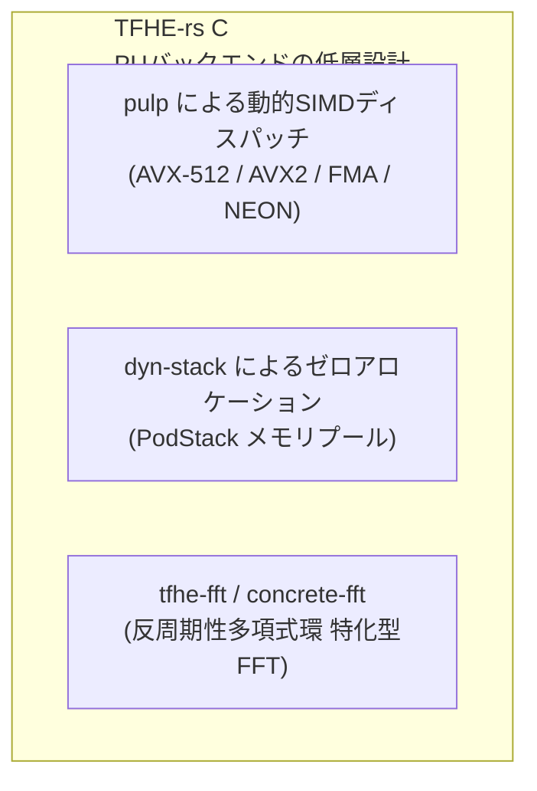

# TFHE-rsの実装に見る物理レイヤ・ハードウェア最適化の全貌

本ドキュメントでは、Zama社が開発する **TFHE-rs** の公式実装・ソースコード・アーキテクチャをもとに、完全準同型暗号（TFHE）のProgrammable Bootstrapping（PBS）を現実的な速度で動作させるための**物理レイヤ（CPU命令、メモリ管理、GPUアーキテクチャ、通信帯域）における具体的な最適化実装**をまとめます。

---

## 1. 物理レイヤにおける根本課題（なぜ低層の工夫が必須か）

TFHEのブートストラッピング（PBS）は、暗号理論的には「多項式の積和演算の繰り返し」ですが、計算機工学（ハードウェア視点）では以下の物理的限界に直面します。

1. **メモリバウンド（Memory-Bound）の極み**:
   * ブートストラッピング鍵（BSK）やキースイッチング鍵（KSK）は数十MB〜数GBに達します。
   * FFT（バタフライ演算）や多項式乗算では大量のメモリアクセスが発生し、**CPU/GPUコアの演算器の速度よりも、メモリバス（DRAM/VRAM）からデータを吸い上げる速度が律速**になります。
2. **OSシステムコールによるミリ秒単位の遅延**:
   * 1回のPBSで数千回発生する一時配列（スクラッチパッド）のメモリ確保（`malloc`/`free`）やページフォールトが、暗号演算本体よりも大きなオーバーヘッドになります。

---

## 2. CPU実行レイヤ：TFHE-rsにおける実装と工夫

TFHE-rsのCPUバックエンドでは、純粋なRust実装でありながらC/C++やアセンブリに匹敵する速度を出すため、以下の低レイヤ設計が施されています。

### ① `pulp` クレートによる安全・高速な動的SIMDディスパッチ
* **実装クレート**: `pulp`（Zama社リードエンジニア開発の安全なSIMD抽象化ライブラリ）
* **仕組み**:
  * コンパイル時に特定のCPUターゲットへ固定するのではなく、**実行時（Runtime）にCPUのCPUID命令を検知**し、最適な命令セット（`AVX-512F`, `AVX2+FMA`, ARM `NEON`, `SVE`）へ分岐（動的ディスパッチ）します。
  * `tfhe-fft` や多項式加算ルーチンにおいて、512bit幅のレジスタ（ZMMレジスタ）に8個の倍精度浮動小数点（f64）や16個の単精度（f32）を詰め込み、複素数乗算（実部・虚部のクロス積）を1サイクルで完全並列実行します。

### ② `dyn-stack` による「動的メモリアロケーション（`malloc`）」の完全排除
* **実装クレート**: `dyn-stack`
* **仕組み**:
  * 演算ループの内部で Rust の `Vec::new()` やヒープ確保を呼び出すことを完全に禁止しています。
  * PBS開始前に必要なテンポラリメモリ（Scratch space）の最大サイズを事前計算（`bootstrapping_scratch_space()`）し、**単一の巨大なバイト配列（`PodStack`）として一括確保**。
  * 関数の引数には `PodStack` のポインタとオフセット（スライス）のみを渡し、ポインタの進退だけでメモリ領域を使い回します。これにより、**システムコール（`brk`/`mmap`）やOSのページフォールトのオーバーヘッドが0%** になります。

### ③ `tfhe-fft`（旧 `concrete-fft`）：反周期多項式環に特化したFFT
* **仕組み**:
  * 一般のFFT（$X^N - 1$ を法とする巡回畳み込み）ではなく、TFHE特有の**反周期多項式環 $\mathbb{R}[X]/(X^N + 1)$** に直接対応したNegacyclic FFTアルゴリズムを実装。
  * 回転因子（Twiddle Factors）をメモリ上に連続配置（Cache-friendly Alignment）し、データサイズを一般FFTの $N$ から $N/2$ の複素数に半減させてキャッシュヒット率（L1/L2 Cache）を最大化しています。

---

## 3. GPU実行レイヤ：`tfhe-cuda-backend` における実装と工夫

NVIDIA GPU（CUDA）上での高速化を担当する `tfhe-cuda-backend` では、PCIe転送とGPUメモリ階層（HBM、共有メモリ、レジスタ）を物理的に使い倒す設計になっています。

### ① カーネル融合（Kernel Fusion）とオンチップメモリ完結
* **課題**: 多項式の乗算やFFTを別々のCUDAカーネルで実行すると、毎回低速なグローバルメモリ（VRAM）への中間データの読み書きが発生し、メモリ帯域を浪費します。
* **実装**:
  * **カーネル融合**: 「外積 ➔ FFT ➔ 多項式積 ➔ 逆FFT ➔ アキュムレータ更新」を1つの巨大なCUDAカーネルに統合。
  * **共有メモリ（Shared Memory）の活用**: スレッドブロック内で共有メモリを「Ping-Pongバッファ（二重バッファ）」として使い、グローバルメモリへのアクセスなしにバタフライ演算を高速パイプライン実行します。

### ② BSKのVRAM常駐化と非同期転送（CUDA Streams）
* **実装**:
  * 数百MB〜数GBにおよぶブートストラッピング鍵（`CudaBootstrapKey`）は、**初期化時にGPUのVRAMへ事前に一括転送・常駐**させます。
  * 入出力暗号文の転送には **ページロックメモリ（Pinned Host Memory）** を使用し、PCIe経由の非同期DMA転送（`cudaMemcpyAsync`）を実行。
  * **CUDA Streams**: 「暗号文 $i+1$ のGPUへの転送」「暗号文 $i$ のGPU上でのPBS演算」「暗号文 $i-1$ のCPUへの転送」をオーバーラップ（重複実行）させ、PCIeの転送遅延を隠蔽（Hide Latency）します。

### ③ Multi-bit PBS（複数ビット一括処理）の物理的利点
* 鍵ビットを2〜4ビットずつまとめて処理するMulti-bit PBSは、CPUでは鍵サイズが大きくなりメモリを圧迫しますが、**GPU環境ではスレッド稼働率（Occupancy）を飛躍的に向上**させます。
* 多項式の回転パターンの事前計算（LUTの線形結合）をGPUの数千コアに一斉分散させることで、GPUの並列計算能力をフル稼働させます。

### ④ ドライバ遅延の排除（`CUDA_MODULE_LOADING=EAGER`）
* TFHE-rs公式ドキュメントでも推奨されている物理環境設定。
* デフォルトの遅延読み込み（Lazy Loading）を無効化し、初回実行時のドライバによるJITコンパイルやカーネルロードのスパイク遅延を抑止します。

---

## 4. 物理最適化の技術マッピングまとめ

| 最適化の分類 | 対象ハードウェア | TFHE-rsでの実際の実装 / クレート名 | 解決する物理的ボトルネック |
| :--- | :--- | :--- | :--- |
| **動的SIMDディスパッチ** | CPU (x86_64 / ARM) | `pulp` (AVX-512, AVX2, FMA, NEON) | 複素数乗算・多項式加算の命令レベル並列化 |
| **メモリ事前一括確保** | CPU (メモリ管理) | `dyn-stack` (`PodStack`) | `malloc`/`free` に伴うOSシステムコールと遅延の完全排除 |
| **反周期性特化FFT** | CPU / GPU | `tfhe-fft` (`concrete-fft`) | キャッシュ使用量半減・メモリアライメントによる局所性向上 |
| **演算融合・共有メモリ** | GPU (NVIDIA CUDA) | `tfhe-cuda-backend` (Fused Kernel, Ping-Pong Buffers) | VRAM帯域幅の枯渇防止（中間データのレジスタ・共有メモリ内完結） |
| **非同期ストリーム転送**| PCIe / GPU通信 | Pinned Host Memory + CUDA Streams | PCIeバスのデータ転送遅延の隠蔽（計算と通信の重複） |
| **スレッド並列化** | マルチコアCPU | `rayon` (Chunking / Batch PBS) | CPU全コアの飽和利用・NUMAノード間通信の低減 |
