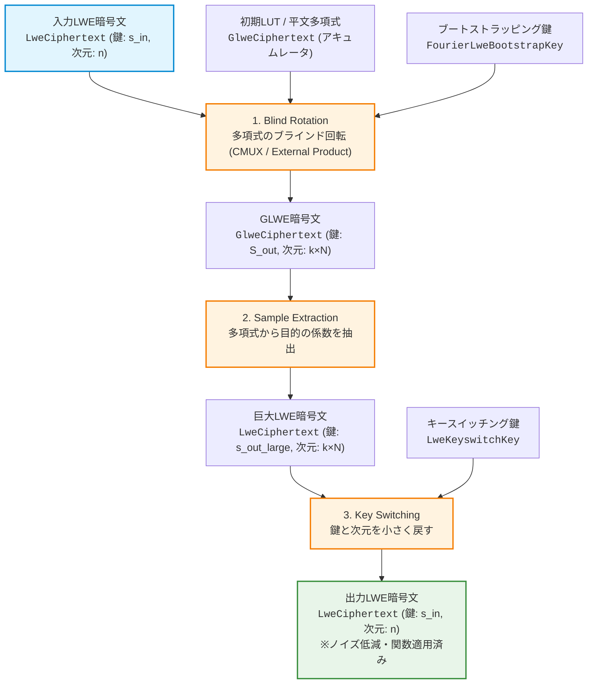

# TFHEの高速化とPBS（Programmable Bootstrapping）の仕組み

このドキュメントでは、TFHE（完全準同型暗号）の核となる処理「**PBS（プログラマブル・ブートストラッピング）**」の流れを整理し、実際のライブラリ（**TFHE-rs**）でどのような高速化の工夫が施されているかを、わかりやすい一般的な日本語で解説します。

---

## 1. PBS（Programmable Bootstrapping）の流れと入出力

暗号化されたデータを計算し続けると、「ノイズ（誤差）」が溜まっていき、最終的にデータが壊れて元に戻せなくなります。PBSは、**暗号化されたデータのノイズを取り除き（リフレッシュし）、同時に関数計算（ルックアップテーブルの適用）を行う**ための処理です。

ホワイトボードで発表する際は、以下の構成に沿って「**理論上の役割**」「**TFHE-rsでの実装（型と関数）**」「**ホワイトボード図示のポイント**」をセットで説明すると理解しやすくなります。

---

### 各処理の「実装と理論」の解説

#### 1. 入力LWE (Input LWE Ciphertext)
*   **理論上の役割**: 計算の過程で**ノイズ（誤差）が限界まで溜まり、これ以上計算できない状態**になっている暗号文です。
*   **実装（TFHE-rs）での表現**:
    *   データ型: `LweCiphertext`
    *   内部パラメータ: 小さなLWE次元 $n$（例: 500〜800程度）、秘密鍵 $s_{in}$。
*   **ホワイトボード説明のコツ**: 
    *   「サイズは小さいが、ノイズが限界」と表現します。
    *   LWE暗号文は「データの本体（マスク）と、ノイズを含んだ暗号値」のペア $(a, b) = (a_1, \dots, a_n, b)$ で構成されていることを軽く図示します。

#### 2. Blind Rotation (ブラインド・ローテーション)
*   **理論上の役割**: 暗号文の値を「多項式の回転（シフト）」にマッピングし、暗号化された秘密鍵を使ってアキュムレータ（GLWE暗号文）を回転させます。これにより、ノイズを削減しつつ、目的の関数（LUT）を適用します。
*   **実装（TFHE-rs）での表現**:
    *   アキュムレータ（初期入力）: 計算したい関数を書き込んだ多項式形式の暗号文 `GlweCiphertext`（ルックアップテーブル: LUT）。
    *   回転を実行する鍵: `FourierLweBootstrapKey`（フーリエ領域で表現されたブートストラッピングキー。計算高速化のため）。
    *   関連関数/メソッド: `blind_rotate` もしくは `blind_rotate_assign`。
*   **入出力**:
    *   **入力**: `LweCiphertext`（入力LWE）、`FourierLweBootstrapKey`（BSK）、`GlweCiphertext`（初期アキュムレータ/LUT）。
    *   **出力**: 関数が適用され、ノイズが劇的に減った **`GlweCiphertext`（大きな多項式形式の暗号文）**。
*   **ホワイトボード説明のコツ**:
    *   「暗号文を復号することなく、暗号化された鍵（BSK）を使って、アキュムレータを『ブラインド（暗号化された状態）』で回転させる処理」であることを強調します。
    *   多項式 $A(X) = a_0 + a_1 X + a_2 X^2 + \dots$ の掛け算によって、指数部分をシフトするイメージを描きます。

#### 3. Sample Extraction (サンプル・エクストラクション)
*   **理論上の役割**: 前の処理で得られた多項式形式の `GlweCiphertext` の中から、**目的の計算結果が格納されている特定の係数（通常は定数項）だけを取り出して、再び通常のLWE暗号文の形に戻します**。
*   **実装（TFHE-rs）での表現**:
    *   関連関数/メソッド: `extract_lwe_sample_from_glwe_ciphertext`
*   **入出力**:
    *   **入力**: `GlweCiphertext`（多項式形式、次元 $k$, 多項式次数 $N$）。
    *   **出力**: 通常の暗号文形式に戻された **`LweCiphertext`**。ただし、GLWEの鍵構造を引き継ぐため、**次元が非常に大きくなったLWE暗号文**（次元 $k \times N$, 鍵 $s_{out\_large}$）になります。
*   **ホワイトボード説明 of コツ**:
    *   「長い多項式（GLWE）から、必要な『結果の1コマ』だけをピンセットでつまみ出す処理」と説明します。
    *   つまみ出した結果、形式はLWEに戻りますが、次元が $n$ から $k \times N$（例: 2048など）へと数倍に巨大化している点に注目させます。

#### 4. Key Switching (キー・スイッチング)
*   **理論上の役割**: 前の処理で巨大化した暗号文（次元 $k \times N$）を、再び安全かつ計算しやすい元の小さなサイズ（次元 $n$）および元の鍵 $s_{in}$ に変換して戻します。
*   **実装（TFHE-rs）での表現**:
    *   切り替え用の鍵: `LweKeyswitchKey`（KSK）
    *   関連関数/メソッド: `keyswitch_lwe_ciphertext`
*   **入出力**:
    *   **入力**: 大きくなった `LweCiphertext`、`LweKeyswitchKey`（KSK）。
    *   **出力**: **元の鍵・元のサイズ（次元 $n$）に戻った `LweCiphertext`**。
*   **ホワイトボード説明のコツ**:
    *   「大きくなった服（巨大LWE）から、動きやすい元のサイズの服（通常LWE）に着替えさせる処理」と説明します。
    *   このキースイッチによって、次の計算に進める準備が整います。

#### 5. 出力LWE (Output LWE Ciphertext)
*   **理論上の役割**: ノイズがリフレッシュされ、目的の計算が適用された新しい `LweCiphertext` です。ここから再び次の足し算や乗算などを進めることができます。

---

## 2. どこを・どのようにして高速化しているか？

TFHE-rsなどのライブラリでは、最も処理の重い「**Blind Rotation**」と「**Key Switching**」を中心に、以下のような高速化の工夫が行われています。

### ① 特化型FFT（高速フーリエ変換）による多項式掛け算のスピードアップ
* **対象の処理**: `Blind Rotation`（多項式同士の掛け算）
* **仕組み**: 
  多項式の掛け算をそのまま行うと、計算回数が非常に多くなります。そこで「FFT（高速フーリエ変換）」を使って、掛け算を簡単な足し算・引き算・単純な掛け算に変換して一瞬で終わらせます。特にTFHE-rsでは、暗号の性質である「反周期性（特定のパターンで符号が反転する性質）」に特化したFFT（`concrete-fft`）を自社開発しています。
* **速くなる理由**: 
  一般的なFFTに比べて計算に必要なメモリや計算の手間を**半分**に削減できます。
* **代わりに増えるコスト（代償）**: 
  計算に小数（浮動小数点数）を使うため、コンピューターの仕組み上、**ごくわずかな計算誤差（丸め誤差）**が発生します。これが暗号のノイズをわずかに増やすため、安全性を保つための設計が少し難しくなります。

### ② Multi-bit PBS（複数ビットの一括処理）
* **対象の処理**: `Blind Rotation`
* **仕組み**: 
  通常は鍵のデータを1ビット（0か1か）ずつ順番に確認して処理を進めますが、これを数ビット（例えば2〜4ビット）まとめて一気に処理します。
* **速くなる理由**: 
  順番に計算する回数（ループ回数）が、2ビットまとめれば半分、3ビットまとめれば3分の1に減ります。また、GPUなどの並列計算機に仕事を投げやすくなり、処理速度が飛躍的に向上します。
* **代わりに増えるコスト（代償）**: 
  事前準備として用意する鍵（ブートストラッピングキー）のデータ量が**数倍〜十数倍に巨大化**します（例：4ビットまとめると鍵のサイズは約3.75倍になります）。

### ③ GPU（CUDA）による超並列処理
* **対象の処理**: `Blind Rotation`（特にFFTや掛け算の繰り返し）
* **仕組み**: 
  CPUではなく、何千もの計算を同時に処理できるグラフィックボード（GPU）に計算を行わせます。TFHE-rsでは、汎用のGPUライブラリを使わず、TFHEの計算に特化した専用のプログラム（CUDAカーネル）を独自に作成しています。
* **速くなる理由**: 
  膨大な数の掛け算を、すべてのスレッドで同時に実行するため、圧倒的な処理速度が得られます。
* **代わりに増えるコスト（代償）**: 
  高性能なGPUが必要になり、GPU上のビデオメモリ（VRAM）を数ギガバイトから数十ギガバイト単位で大量に消費します。

### ④ メモリの事前一括確保（`dyn-stack`の利用）
* **対象の処理**: `すべての処理`
* **仕組み**: 
  プログラムの実行中に「データを置くための新しいメモリ領域をその都度確保して、使い終わったら片付ける」という処理（動的メモリ確保）を一切行いません。計算が始まる前に、必要なメモリの最大量を計算して一括で確保し、それをみんなで使い回します。
* **速くなる理由**: 
  OSに対してメモリを要求する手続き（システムコール）のオーバーヘッド（無駄な時間）がゼロになります。
* **代わりに増えるコスト（代償）**: 
  プログラムのコードの作りが非常に複雑になり、開発やメンテナンスの難易度が上がります。

### ⑤ PFPKS（鍵切り替えとパッキングの同時処理）
* **対象の処理**: `Key Switching`
* **仕組み**: 
  暗号文の鍵を切り替えると同時に、バラバラだった複数の暗号文を1つの大きな多項式暗号文の空きスペースに「詰め合わせ（パック）」します。
* **速くなる理由**: 
  お中元の詰め合わせのように、まとめて1つの箱に入れることで、後続の計算（次のPBSなど）を一度にまとめて処理（SIMD化）できるようになり、1個あたりの平均計算時間が大幅に短縮されます。
* **代わりに増えるコスト（代償）**: 
  パッキング用の鍵のサイズが非常に大きくなり、パソコンやサーバーのメモリを圧迫します。

---

## 3. 高速化手法のまとめ（一覧表）

| 高速化の工夫 | 適用場所 | どんな仕組み？ | メリット（なぜ速い？） | デメリット（代償・コスト） |
| :--- | :--- | :--- | :--- | :--- |
| **特化型FFT** | Blind Rotation | 反周期性を利用した専用 of FFT計算 | 計算量とメモリ使用量を**半分**にする | 計算による微小な誤差（丸め誤差）が発生する |
| **Multi-bit PBS** | Blind Rotation | 鍵ビットを2〜4個まとめて一気に処理 | 計算のステップ数（ループ）が激減する | 鍵のファイルサイズが数倍に膨れ上がる |
| **GPU並列計算** | Blind Rotation | GPUの大量のスレッドで並列に計算する | 超高速に多項式の掛け算が終わる | 高価なGPUが必要で、ビデオメモリを大量消費する |
| **dyn-stack** | 全体 | メモリをその都度確保せず、最初に一括確保 | メモリ確保にかかる無駄な時間がゼロになる | プログラムのコードが複雑になる |
| **PFPKS（パッキング）**| Key Switching | 鍵を切り替えつつ、複数のデータを1つにまとめる | 次からの計算をまとめて一発で実行できる | パッキング用の鍵が巨大化する |

---

## 4. 新たに生まれた疑問・これからの検討事項

1. **丸め誤差が及ぼす限界はどこか？**
   特化型FFTは速いですが、浮動小数点による微小な「丸め誤差」が生じます。この誤差が積み重なると、暗号化されたデータが壊れてしまいます。何回連続でPBSを呼び出すとデータが壊れるのか、その境界線はどこにあるのでしょうか？
2. **GPUメモリの限界（ボトルネック）**
   高速化を追求してMulti-bit PBSなどを組み合わせると、鍵のサイズが数GB〜数十GBに達します。計算自体はGPUで一瞬で終わっても、鍵をGPUに転送する時間や、GPUのメモリ容量そのものが足りなくなる問題（ボトルネック）はどのように解決しているのでしょうか？
3. **パラメータ設定の難しさ**
   高速化の手法を組み合わせると、ノイズの増え方や必要な鍵サイズが複雑に変化します。TFHE-rsにはパラメータを自動で決めてくれる機能がありますが、メモリ容量などのハードウェアの限界まで考慮して、一番良いパラメータを本当に自動で選べるのでしょうか？
