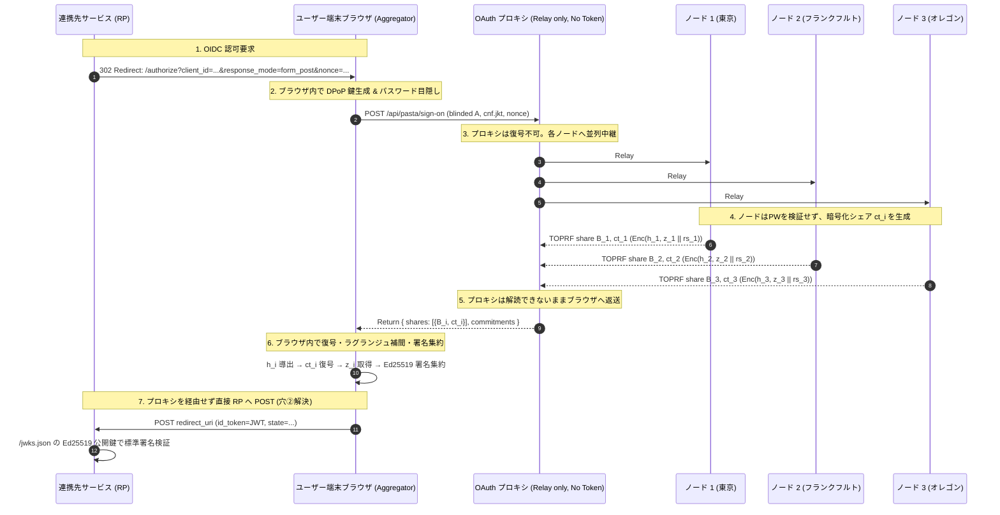

# PASTA 分散 IdP アーキテクチャ仕様書 (TypeScript 実装版)

本ドキュメントは、[`docs/implementation.md`](./implementation.md) の PASTA (CCS 2018) + FROST (RFC 8032 Ed25519) 暗号プロトコル、および [`docs/whiteboard-gaps.md`](./whiteboard-gaps.md) に示された OAuth プロキシの「Token を持たない AS」アーキテクチャと 7 つの穴（課題）に対する技術的解決仕様を定めたものです。

---

## 1. 全体アーキテクチャと設計目標

### 1.1 脅威モデルと根本課題
集権的 IdP における最大脅威は **なりすまし**（IdP 運営者の悪意やサーバー侵害による全権限掌握）です。
本システムでは以下の二重の暗号学的束縛により、この脅威を排除します：
1. **署名鍵の分散 (FROST Ed25519 閾値署名)**: 署名鍵 $s$ は単一ノードに存在せず、$t$-of-$n$ のシェア $s_i$ として分散される。
2. **忘却型認証による束縛 (PASTA 方式)**: ノードはパスワードを検証せず、署名シェア $z_i$ をパスワード由来の鍵 $h_i$ で暗号化して返却する。正しいパスワードを持つ端末のみが暗号文を解錠でき、完全な署名を集約できる。

### 1.2 OAuth プロキシの「Token を持たない AS」構造
RP（Relying Party）から見た接続先は単一の OAuth プロキシですが、**プロキシは暗号化シェアを中継するのみで、平文のトークンやパスワード、署名鍵を一切持ちません**。

---

## 2. ホワイトボードの穴（穴①〜⑦）に対する技術的解決仕様

| 穴 | 課題 | 深刻度 | 本実装における解決仕様 |
|:---|:---|:---:|:---|
| **穴① オリジン問題** | ログイン JS をプロキシが配信すると、悪意ある JS でパスワードが抜ける | 致命 | **クライアント SDK 化 + WebAuthn/パスキー連携**: 将来的なフィッシング耐性として WebAuthn オリジン束縛（`clientDataJSON`）を前提とし、現在はブラウザ SDK が端末内で目隠しを実行。 |
| **穴② どの OAuth フローか** | 認可コードフローでは AS がトークンを保持するため「Token を持たない」が破綻する | 致命 | **`response_mode=form_post` (OIDC 標準) の強制採用**: ブラウザ側で集約された `id_token` を RP の `redirect_uri` へ直接 POST。プロキシの通信経路上には暗号化シェアしか流れず、平文トークンを観測できないことを構造的に保証。 |
| **穴③ 失敗観測不可** | サーバーは成功と失敗を区別できないため、失敗回数ベースのロックアウトが原理的に作れない | 致命 | **総試行数ベースのレート制限 + オンライン攻撃強制**: TOPRF によりオフライン辞書攻撃は数学的に遮断されるため、ノード側での IP / `sub` 単位の総リクエスト数制限によって緩和。 |
| **穴④ PoP トークンの動的性** | PoP トークンは静的な 1 枚ではなく、リクエスト毎の証明 | 軽微 | **RFC 9449 DPoP 完全準拠**: Client SDK が HTTP リクエストごとに `htm` / `htu` / `iat` / `jti` を署名した DPoP Proof JWT を生成。Sign-on 時に `cnf.jkt` としてトークンへ厳格束縛。 |
| **穴⑤ リフレッシュトークン** | パスワードなしで安全に新シェアを発行できるか（定足数交差の限界） | 原理的制約 | **セッション秘密 $rs_i$ 同梱 + ノード独立 DPoP 検証**: sign-on 時に各ノードが $rs_i$ を暗号文に同梱。refresh 時に各ノードが DPoP 署名を独立検証し、$rk_i = \text{HKDF}(rs_i, ctr)$ で暗号化新シェアを発行。RFC 9700 §4.14 の sender-constrained 仕様を満たす。 |
| **穴⑥ サブジェクトプライバシ** | `sub` / `aud` は各ノードから平文で見えてしまう | 軽微 | **標準互換性のトレードオフとして受容**: 標準 OIDC JWT 互換を保つため平文とする。ペアワイズ擬似 ID の導入が将来の拡張として可能。 |
| **穴⑦ エフェメラルキーの保管** | DPoP 鍵の寿命と漏洩リスク | 軽微 | **WebCrypto non-extractable / メモリ保持**: Client SDK 内で非抽出キーペアとして保持し、XSS による秘密鍵抽出を防止。 |

---

## 3. 暗号プロトコル仕様

### 3.1 Ed25519 スカラー体上の Shamir 秘密分散
- 位数: $\ell = 2^{252} + 27742317777372353535851937790883648493$
- ラグランジュ補間係数:
  $$\lambda_i(0) = \prod_{j \in S, j \neq i} \frac{x_j}{x_j - x_i} \pmod \ell$$

### 3.2 2HashTDH 閾値 OPRF (Ristretto255 群)
1. **ブラインド化 (Client)**:
   $$H_1(pw) \in \text{Ristretto255}, \quad A = r \cdot H_1(pw)$$
2. **部分評価 (Node $i$)**:
   $$B_i = k_i \cdot A$$
3. **結合・アンブラインド (Client)**:
   $$C = \sum_{i \in S} \lambda_i B_i, \quad v = r^{-1} \cdot C = H_1(pw)^k$$
4. **鍵導出**:
   $$h = H_2(pw, v), \quad h_i = H_3(h, i) \pmod \ell$$

### 3.3 FROST 閾値 Schnorr 署名 (Ed25519 RFC 8032)
1. **コミットメント (Round 1)**: 各ノード $i$ が秘密ノンス $(d_i, e_i)$ を生成し、$D_i = d_i B, E_i = e_i B$ を公開。
2. **バインディング & チャレンジ**:
   $$\rho_i = H(\dots), \quad R = \sum (D_i + \rho_i E_i)$$
   $$c = \text{SHA-512}(R \parallel Y \parallel \text{signingInput}) \pmod \ell$$
3. **署名シェア生成 (Node $i$)**:
   $$z_i = d_i + \rho_i e_i + \lambda_i s_i c \pmod \ell$$
4. **暗号化 & AAD バインディング**:
   $$ct_i = \text{ChaCha20-Poly1305}.\text{Encrypt}_{h_i}(\text{nonce}, z_i \parallel rs_i, \text{AAD}=\text{signingInput})$$
5. **署名集約 (Client)**:
   $$z = \sum_{i \in S} z_i \pmod \ell \implies \text{Signature} = (R, z) \in \{0,1\}^{64}$$

---

## 4. OIDC / OAuth エンドポイント仕様

| メソッド | パス | 役割 | レスポンス / 特徴 |
|:---|:---|:---|:---|
| `GET` | `/.well-known/openid-configuration` | Discovery ドキュメント | `response_modes_supported: ["form_post"]`, `id_token_signing_alg_values_supported: ["EdDSA"]` |
| `GET` | `/jwks.json` | 公開鍵セット | RFC 8037 準拠の Ed25519 グループ公開鍵 1 本 |
| `GET` | `/authorize` | 認可エンドポイント | `response_mode=form_post` を強制し、ブラウザ内暗号集約画面を提供 |
| `GET` | `/demo` (または `/`) | React デモ UI | 3ノード通信・署名集約・JWTインスペクタを備えたモダンUI |
| `POST` | `/api/pasta/sign-on` | プロキシ中継 | 暗号化シェア $ct_i$ の並列中継（プロキシは内容解読不可） |
| `POST` | `/api/pasta/refresh` | リフレッシュ中継 | DPoP Proof 付きリフレッシュ中継（各ノードが独立検証） |
| `POST` | `/demo/rp-callback` | RP 受取コールバック | RP 側で標準 Ed25519 署名および state パラメータを検証 |

---

## 5. テスト・検証実績

- **Vitest 統合テスト**: 全 38 件 合格
  - `tests/crypto/crypto.test.ts` (14/14 件 PASS)
  - `tests/pasta_integration.test.ts` (14/14 件 PASS)
  - `tests/gateway_and_dpop.test.ts` (10/10 件 PASS)
- **独立した外部検証器 (`scripts/verify_token.py`)**:
  - Python `cryptography` (OpenSSL): 検証成功
  - PyNaCl (libsodium): 検証成功
  - ペイロード改竄 (`sub: admin`): 拒絶成功
