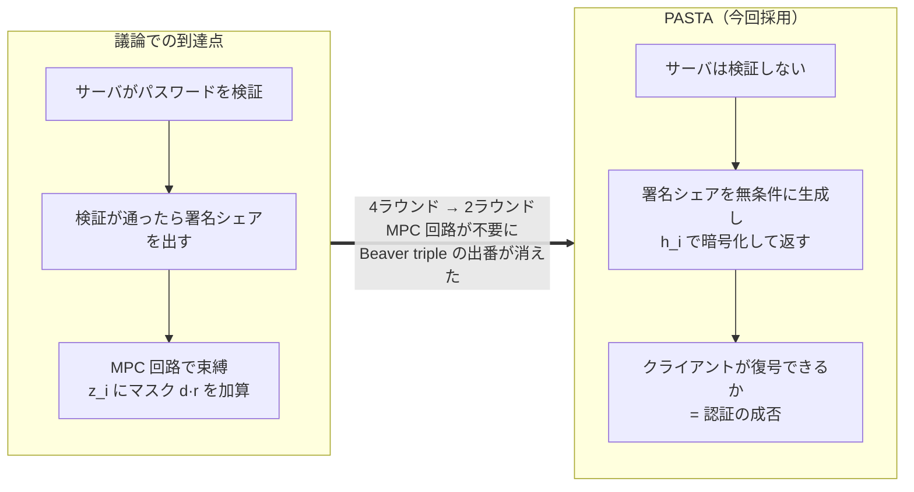
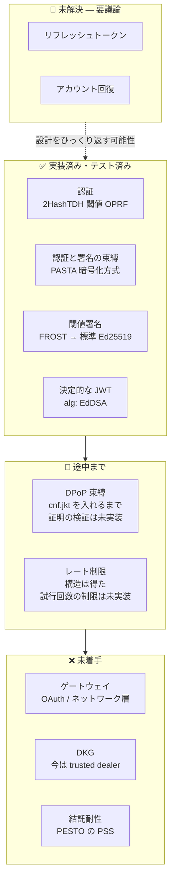
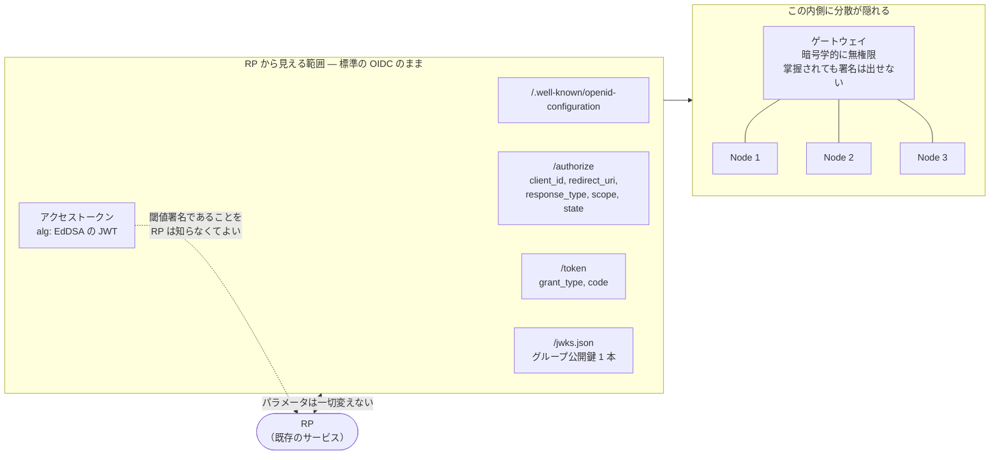
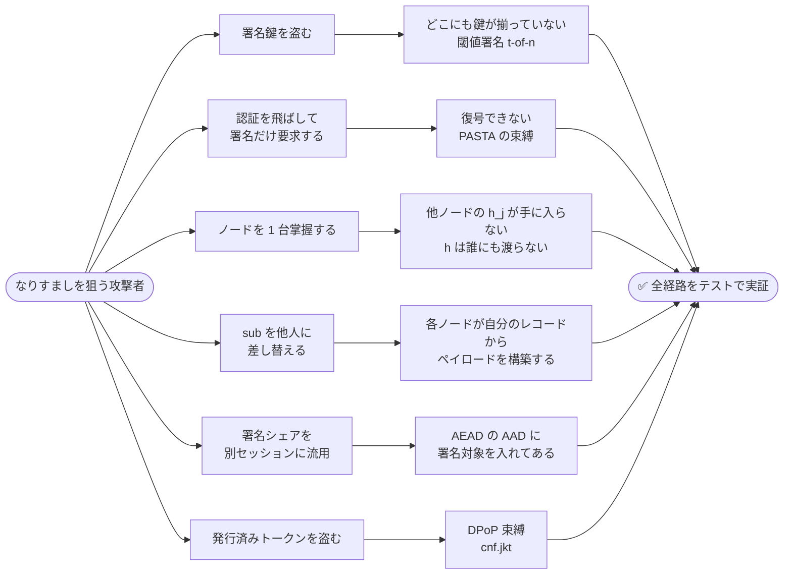
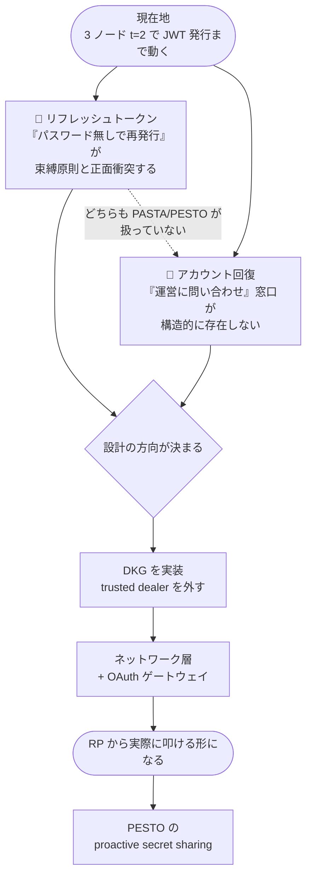

# 進捗と残論点 (2026-08-22)

[Issue #81](https://github.com/zk-tokyo/advanced-cryptography-2026/issues/81) について、
**今回どこまで作ったか** と **何が残っているか**。

---

## 図解

### 方針の変化 — 議論での到達点 → PASTA



### 到達度 — 何ができて何が残っているか



### OAuth / OIDC の形式は保つ

**RP から見える形式は標準の OIDC のまま変えない。** 分散はゲートウェイの内側に隠す。
Issue の「受け渡すパラメータは変えず、既存の集権的 IdP をそのまま置き換える」という前提。



| RP から見えるもの | 状態 |
|:--|:--|
| **アクセストークン（`alg: EdDSA` の JWT）** | ✅ **実装済**。標準の Ed25519 検証器で通ることを確認済み |
| `/.well-known/openid-configuration` | ❌ 未実装 |
| `/authorize`（client_id, redirect_uri, response_type, scope, state） | ❌ 未実装 |
| `/token`（grant_type, code） | ❌ 未実装 |
| `/jwks.json`（グループ公開鍵 1 本） | ❌ 未実装 |

**いちばん互換性が問われる「トークンそのもの」は既に標準形式で出せている。**
クレームも `iss` / `sub` / `aud` / `iat` / `exp` / `jti` / `cnf` と標準のものだけで構成してある。
残っているのはエンドポイントの実装で、これは論点E（ゲートウェイ）に含まれる。

> ⚠️ 唯一標準から外れうるのが **論点G（リフレッシュトークン）**。
> OAuth の `grant_type=refresh_token` を素直に実装すると束縛原則と衝突するので、
> 「形式を保つ」ことと「なりすまし耐性」がここで正面からぶつかる。

### 塞いだなりすまし経路

テスト 28 本が、それぞれどの攻撃経路に対応しているか。



### 残論点の依存関係と優先順位



---

## 今回できたこと

### 1. 先行研究が見つかった（方針が変わった）

**[PASTA (CCS 2018)](https://eprint.iacr.org/2018/885)** が、この Issue とほぼ同一のテーマを
既に定式化・実装・証明していた。**[PESTO (EuroS&P 2020)](https://eprint.iacr.org/2019/1470)** がその改良版。

これにより、議論で到達していた「認証と署名をひとつの MPC 回路に束縛する」という方針が変わった。
PASTA の解き方は **サーバはパスワードを検証せず、署名シェアをパスワード由来の鍵で暗号化して返す**。
正しいパスワードを持つクライアントだけが復号して結合できる。
「認証が通らないと署名が発火しない」を、発火の制御ではなく **復号の可否** で実現している。

結果として **MPC 回路が不要になり、既存の Beaver triple 実装は今回の構成では使っていない**。

詳細 → [prior-art.md](./prior-art.md)

### 2. 動く PoC ができた

3 ノード / 閾値 2 で、パスワード認証からアクセストークン発行までが通る。

```sh
cargo test --lib --test pasta_integration        # 28 テスト
cargo run --bin pasta_demo | python3 scripts/verify_token.py
```

**いちばん重要な確認結果:**
どのノードも署名鍵を持っていないのに、出てきた JWT が **標準の Ed25519 検証器で通る**。
検証は Python の `cryptography` (OpenSSL 系) と PyNaCl (libsodium) で行っており、
IdP 側の実装を一切共有していない。つまり RP は閾値署名であることを知る必要がない。

これが「既存の集権的 IdP をそのまま置き換える」という目標に対する答えになる。

詳細 → [implementation.md](./implementation.md)

---

## 論点ごとの到達度

[design-discussion.md](./design-discussion.md) で洗い出した論点 A〜J の現在地。

| # | 論点 | 状態 | 中身 |
|:--|:--|:--|:--|
| A | 認証方式 | ✅ 実装済 | 2HashTDH 閾値 OPRF。TOPRF 鍵はクライアントごとに生成 |
| B | 認証と署名の束縛 | ✅ 実装済 | **PASTA 方式に変更。** MPC 回路は不要になった |
| C | 閾値署名 | ✅ 実装済 | FROST 方式の閾値 Schnorr → 標準 Ed25519 署名 |
| D | ペイロードの決定性 | ✅ 実装済 | 落とし穴を1つ発見（後述） |
| E | ゲートウェイ / OAuth 互換 | ❌ 未実装 | サーバはプロセス内の構造体。ネットワーク層と OAuth 層が無い |
| F | トークン束縛 (DPoP) | 🔺 半分 | `cnf.jkt` をペイロードに入れるところまで。DPoP 証明の検証は未実装 |
| G | **リフレッシュトークン** | ❌ **未解決** | 束縛原則と正面衝突する。PASTA/PESTO も扱っていない |
| H | **アカウント回復** | ❌ **未解決** | 分散環境に「運営に問い合わせ」窓口が無い |
| I | レート制限 | 🔺 構造のみ | TOPRF がオンライン攻撃を強制する性質は得た。試行回数の制限は未実装 |
| J | 結託耐性 | ❌ 未実装 | PESTO の proactive secret sharing に答えがある |
| — | DKG（分散鍵生成） | ❌ 未実装 | 署名鍵を trusted dealer で作っている。生成時点では鍵が揃ってしまう |

---

## 実装して分かったこと（議論に戻したい3点）

### 1. 時刻の量子化だけでは決定性は得られない

`iat` を 30 秒に丸めればノード間の時計ズレを吸収できると考えていたが、**間違いだった**。
バケット境界をまたぐと、29 秒差でも別の値になる。

正しい構造は「**トランスクリプト中の 1 つの値を全ノードが使う**」。
本実装ではクライアントが提案した `iat` を全サーバが採用し、各サーバは自分の時計を
**許容範囲の検査にだけ** 使っている。

### 2. FROST の t-of-n は「セッション開始後の脱落耐性」ではない

R と λ_i は署名パッケージに載った参加者集合**全体**で決まるので、
3 台がコミットしたセッションで 2 枚だけ集めても署名は成立しない。

t-of-n が与えるのは **どの quorum を選ぶかの自由** であって、
コミット後に 1 台落ちたらセッションごとやり直すことになる。可用性設計に影響する。

### 3. `frost-ed25519` クレートが使えなかった

`frost-ed25519 3.0.0` は `curve25519-dalek = 4.1.3` を**完全一致**で要求するが、
本リポジトリは dalek 5.0.0 を使っている。共存はできるが型が相互運用できない。

そのため FROST を dalek 5.0 上に自前実装した（約 190 行）。
**本番化するなら dalek を 4.1.3 に落として `frost-ed25519` を使うべき。**
自前実装の暗号を運用する理由は無い。

---

## 残論点の優先順位

### 最優先: 論点 G と H

**この2つは設計をひっくり返す可能性がある** ので、実装を進める前に方向だけでも決めたい。
どちらも PASTA / PESTO が扱っておらず、Issue でもまだ議論されていない。

- **G: リフレッシュトークン** — 定義上「パスワードなしで新しいアクセストークンを得る」仕組みなので、
  「認証が通らないと署名が発火しない」という原則と正面衝突する。
  素直に作ると新しい bearer credential が生まれ、それを盗めばなりすませることになる。

  方向の候補:
  - (a) リフレッシュも DPoP 束縛にし、クライアント鍵の所持証明を各ノードが個別に検証する
  - (b) 各ノードが独立にセッション状態を持つ（ステートフルだが失効が効く）
  - (c) リフレッシュを諦め、短命トークン + 都度再認証

- **H: アカウント回復** — 集権 IdP なら「運営に問い合わせて本人確認」で回復できるが、
  分散 IdP にはその窓口が存在しない。パスワードを忘れた瞬間にアカウントが永久に失われるなら実用にならない。

  候補はソーシャルリカバリ / 事前配布のリカバリシェア / 複数デバイス鍵での回復。
  いずれも **回復経路が新しいなりすまし経路にならないか** を同じ厳しさで検証する必要がある。

### 次: 実装を実用に近づけるもの

1. **DKG** — 今は trusted dealer で鍵を作っており、生成時点で鍵が揃ってしまう
2. **ネットワーク層 + OAuth ゲートウェイ（論点E）** — RP から見て標準の OIDC に見せる部分
3. **DPoP 証明の検証（論点F）** — 今は `cnf.jkt` を入れるだけ
4. **レート制限（論点I）** — オンライン辞書攻撃対策の実装

### 最後: 論点 J（結託耐性）

PESTO の proactive secret sharing。Issue でも「一番最後に考えたほうがいい」としていた通り。

---

## 次にやること

1. 論点 G・H を議論して方向を決める
2. DKG を実装して trusted dealer を外す
3. ネットワーク層と OAuth ゲートウェイを載せて、RP から実際に叩ける形にする

## ドキュメント

| ファイル | 内容 |
|:--|:--|
| [readme.md](./readme.md) | 議論の整理と背景 |
| [design-discussion.md](./design-discussion.md) | 論点 A〜J の洗い出しと構造案 |
| [prior-art.md](./prior-art.md) | 先行研究 (PASTA / PESTO) の調査 |
| [implementation.md](./implementation.md) | PoC の実装解説 |
| このファイル | 進捗と残論点 |
