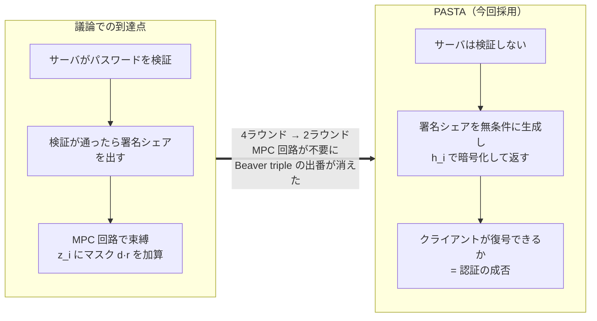
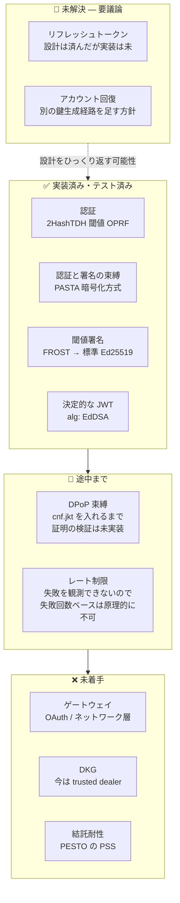
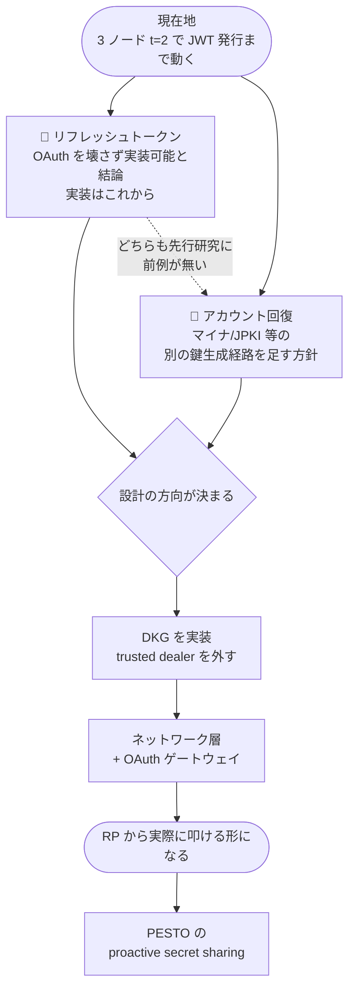

# 進捗と残論点 (2026-08-22)

[Issue #81](https://github.com/zk-tokyo/advanced-cryptography-2026/issues/81) について、
**今回どこまで作ったか** と **何が残っているか**。

---

## 図解

### 方針の変化 — 議論での到達点 → PASTA



### 到達度 — 何ができて何が残っているか



### OAuth / OIDC の形式は保つ

**RP から見える形式は標準の OIDC のまま変えない。** 分散はゲートウェイの内側に隠す。
Issue の「受け渡すパラメータは変えず、既存の集権的 IdP をそのまま置き換える」という前提。


| RP から見えるもの | 状態 |
|:--|:--|
| **アクセストークン（`alg: EdDSA` の JWT）** | ✅ **実装済**。標準の Ed25519 検証器で通ることを確認済み |
| `/.well-known/openid-configuration` | ❌ 未実装 |
| `/authorize`（client_id, redirect_uri, response_type, scope, state） | ❌ 未実装 |
| `/token`（grant_type, code） | ❌ 未実装 |
| `/jwks.json`（グループ公開鍵 1 本） | ❌ 未実装 |

**いちばん互換性が問われる「トークンそのもの」は既に標準形式で出せている。**
クレームも `iss` / `sub` / `aud` / `iat` / `exp` / `jti` / `cnf` と標準のものだけで構成してある。
残っているのはエンドポイントの実装で、これは論点E（ゲートウェイ）に含まれる。

> **論点G（リフレッシュトークン）についても、OAuth を壊さずに実装できる見込みが立った。**
> リフレッシュトークンは仕様上 opaque で、RFC 9449 §5 が「束縛の実装詳細は認可サーバの裁量」と
> 明記しているため、分散 IdP 固有の仕組みを入れる余地が標準の側に空いている。
> 詳細 → [refresh-token.md](./refresh-token.md)

### 塞いだなりすまし経路

テスト 28 本が、それぞれどの攻撃経路に対応しているか。


### 残論点の依存関係と優先順位



---

## 今回できたこと

### 1. 先行研究が見つかった（方針が変わった）

**[PASTA (CCS 2018)](https://eprint.iacr.org/2018/885)** が、この Issue とほぼ同一のテーマを
既に定式化・実装・証明していた。**[PESTO (EuroS&P 2020)](https://eprint.iacr.org/2019/1470)** がその改良版。

これにより、議論で到達していた「認証と署名をひとつの MPC 回路に束縛する」という方針が変わった。
PASTA の解き方は **サーバはパスワードを検証せず、署名シェアをパスワード由来の鍵で暗号化して返す**。
正しいパスワードを持つクライアントだけが復号して結合できる。
「認証が通らないと署名が発火しない」を、発火の制御ではなく **復号の可否** で実現している。

結果として **MPC 回路が不要になり、既存の Beaver triple 実装は今回の構成では使っていない**。

詳細 → [prior-art.md](./prior-art.md)

### 2. 動く PoC ができた

3 ノード / 閾値 2 で、パスワード認証からアクセストークン発行までが通る。

```sh
cargo test --lib --test pasta_integration        # 28 テスト
cargo run --bin pasta_demo | python3 scripts/verify_token.py
```

**いちばん重要な確認結果:**
どのノードも署名鍵を持っていないのに、出てきた JWT が **標準の Ed25519 検証器で通る**。
検証は Python の `cryptography` (OpenSSL 系) と PyNaCl (libsodium) で行っており、
IdP 側の実装を一切共有していない。つまり RP は閾値署名であることを知る必要がない。

これが「既存の集権的 IdP をそのまま置き換える」という目標に対する答えになる。

詳細 → [implementation.md](./implementation.md)

---

## 論点ごとの到達度

論点 A〜J の現在地。

| # | 論点 | 状態 | 中身 |
|:--|:--|:--|:--|
| A | 認証方式 | ✅ 実装済 | 2HashTDH 閾値 OPRF。TOPRF 鍵はクライアントごとに生成 |
| B | 認証と署名の束縛 | ✅ 実装済 | **PASTA 方式に変更。** MPC 回路は不要になった |
| C | 閾値署名 | ✅ 実装済 | FROST 方式の閾値 Schnorr → 標準 Ed25519 署名 |
| D | ペイロードの決定性 | ✅ 実装済 | 落とし穴を1つ発見（後述） |
| E | ゲートウェイ / OAuth 互換 | ❌ 未実装 | サーバはプロセス内の構造体。ネットワーク層と OAuth 層が無い |
| F | トークン束縛 (DPoP) | 🔺 半分 | `cnf.jkt` をペイロードに入れるところまで。DPoP 証明の検証は未実装 |
| G | **リフレッシュトークン** | 🔺 **設計済** | OAuth を壊さず実装可能と結論 → [refresh-token.md](./refresh-token.md) |
| H | **アカウント回復** | ❌ **未解決** | 分散環境に「運営に問い合わせ」窓口が無い |
| I | レート制限 | ❌ 方式の壁 | TOPRF がオンライン攻撃を強制する性質は得た。ただし**サーバは成功と失敗を区別できない**ので、失敗回数ベースのロックアウトは原理的に作れない → [whiteboard-gaps.md 穴③](whiteboard-gaps.md) |
| J | 結託耐性 | ❌ 未実装 | PESTO の proactive secret sharing に答えがある |
| — | DKG（分散鍵生成） | ❌ 未実装 | 署名鍵を trusted dealer で作っている。生成時点では鍵が揃ってしまう |

---

## 実装して分かったこと

設計段階では見えていなかった点が3つあり、いずれも議論に戻す価値がある。
内容は [implementation.md](./implementation.md#実装して分かったこと) に書いた。

1. **時刻の量子化だけでは決定性は得られない** — バケット境界をまたぐと 29 秒差でもズレる
2. **FROST の t-of-n はセッション開始後の脱落耐性ではない** — 可用性設計に影響する
3. **`frost-ed25519` クレートが使えなかった** — dalek のバージョンが噛み合わず自前実装した

---

## 正直に書いておくべき限界

学会投稿を検討するにあたり文献を精査した結果、**当初「新規性」と考えていた点の多くが既出**だった。

| 当初の主張 | 実際 |
|:--|:--|
| 閾値署名で標準 JWT を作り RP 無改造で使える | ❌ **既出。** PESTO (2020) が RSA-JWT で実装・ベンチマーク済み |
| IdP のどのサーバも発行済みトークンを見ない | ⚠️ **PASTA の unforgeability の言い換え**。採用した時点で自動的に付く性質 |
| 各ノードが独立に署名検証してからシェアを出す（refresh） | ⚠️ 産業実装に類似あり（Lit Protocol の SessionSigs） |
| PbTA に OAuth リフレッシュトークンを導入 | 🔺 **論文には見当たらない。**PESTO の "refresh" は鍵の re-share であって別物 |

**加えて、問題②（利用履歴の集約）は現在の設計では解決できていない。**
各ノードは自分でペイロードを構築するので `sub` と `aud` を平文で見ている。
「どのノードも断片しか見えない」は現状**成立しない**。
本気でやるなら blind issuance（[Coconut](https://arxiv.org/abs/1802.07344) 等）が要るが、
それは標準 JWT 互換と両立しない。**「標準互換 vs 発行者プライバシ」はトレードオフ**。

---

## 残論点の優先順位

### 論点G: リフレッシュトークン → 方針が決まった

**OAuth のプロトコルを壊さずに実装できる**と結論した。詳細は [refresh-token.md](./refresh-token.md)。

決め手は3点。リフレッシュトークンは仕様上 **opaque** で中身の規定が無いこと、
RFC 9449 §5 が **「束縛の実装詳細は認可サーバの裁量」** と明記していること、
リクエストの形（`grant_type=refresh_token` + `DPoP` ヘッダ）が標準のままであること。

設計は PASTA の構造をそのまま流用し、**「解錠鍵の供給源」だけを差し替える**。

| フェーズ | 解錠鍵の供給源 | 各ノードが自分で検証するもの |
|:--|:--|:--|
| sign-on | パスワード → TOPRF → `h_i` | （検証しない。復号可否が認証） |
| refresh | sign-on 時に配った `rs_i` | DPoP 証明の署名 |
| recovery | マイナ/JPKI 等の別経路 | 署名 + 証明書チェーン |

DPoP 証明の検証はただの公開鍵署名検証なので閾値プロトコルは不要で、
「外部の認証OKフラグを信用しない」原則も保たれる。

ただし正直に言うと、**refresh は定義上 sign-on より弱い**（知識 → 所持）。
これは OAuth 自体が受け入れているトレードオフで、緩和はローテーションと短命化。
また **PbTA 系で refresh を扱った先行研究が無く、この設計に証明は無い**。

### 論点H: アカウント回復 → 後回し

**別の鍵生成経路（マイナンバーカード/JPKI 等）を足す**方針。
JPKI の署名用証明書は各ノードが独立に検証できるので、上の表のとおり refresh と同じ形に収まる。

外せない条件が1つだけある。

> **回復も t-of-n にすること。**
> 1台が単独で回復を発火できると、その1台の掌握 = アカウント乗っ取りになる。

なお [PAS-TA-U (SPACE'20)](https://eprint.iacr.org/2020/1544) は PASTA に**パスワード更新**を
足した研究だが、旧パスワードを知っている前提なので**忘却からの回復には使えない**。

### 次: 実装を実用に近づけるもの

1. **DKG** — 今は trusted dealer で鍵を作っており、生成時点で鍵が揃ってしまう
2. **ネットワーク層 + OAuth ゲートウェイ（論点E）** — RP から見て標準の OIDC に見せる部分
3. **DPoP 証明の検証（論点F）** — 今は `cnf.jkt` を入れるだけ
4. **レート制限（論点I）** — 失敗回数では数えられないため、総試行数で絞る方式の検討

### 最後: 論点 J（結託耐性）

PESTO の proactive secret sharing。Issue でも「一番最後に考えたほうがいい」としていた通り。

---

## 投稿先の候補（2026年8月調査時点）

新規性の検証で (b)(c) が潰れたため、**「新プリミティブなし・形式的証明なし」を
積極評価する場**を選ぶ。以下はそういう設計になっている会議。

| 締切 | 投稿先 | 形式 | 備考 |
|:--|:--|:--|:--|
| 2026/8/26 (早期) / 9/14 | NIST WPEC 2026 | トーク提案 | 非アーカイブ・オンライン。MPC がスコープ。投稿コスト最小 |
| **2026/9/4** | **IEICE ISEC 研究会** | 和文8p・査読なし | 11/19-20 兵庫。**IEICE 会員限定** |
| 2026/9/8 | IEICE ICSS 研究会 | 和文8p・査読なし | 11/17-18 大津 |
| 2026/9/11 | SPACE 2026 Cycle 2 | LNCS 20p・査読あり | **PAS-TA-U の掲載先**。系譜的に自然 |
| **2026/9/15** | **SSR 2026** | LNCS 23p・査読あり | **Vision トラックが work-in-progress を明示受理**。12/13-15 ボルチモア |
| 2026/9/17 | FC 2027 本会議 | Short 8p・査読あり | Short を "work in progress" と定義 |
| 2026/9/24 | ACNS 2027 Cycle 1 | LNCS 20p・採択率 ~23% | CFP が implementation / deployment / performance を明示列挙。⚠️ **C1 で落ちると C2 に再投稿不可** |
| **2026/10/15** ⚠️ | **RWC 2027** | 3p アブスト | **非アーカイブ＝他会議と併走可**。「理論のみは採択しにくい」と明記。締切は要照会 |
| 2026/10/22 | CT-RSA 2027 | LNCS・採択率 ~35% | 暗号系で最も通しやすい部類。SoK 枠は新規性を要件としない |
| 2026/11/3-5 | IIW #43 | 登録のみ | アンカンファレンス。設計フィードバック用 |
| 2026/11/20 ⚠️ | EuroS&P 2027 | IEEE 13p | **PESTO の掲載先**。日程情報が前年の流用の疑いあり、要再確認 |
| 2026/12月中旬 | SCIS2027 | 和文8p・査読なし | 2027/1 広島（日程は**非公式情報**） |
| 2027/3月頃（見込み） | SeRIM（EuroS&P 併設） | **Tool paper 4p** 枠 | ID管理特化の現存唯一のWS。CFP は2026年12月頃 |
| 2027/5月頃（見込み） | OAuth Security Workshop | トーク | IETF OAuth WG と学術の交流の場 |
| **2027/6月頃（見込み）** | **IWSEC 2027** | LNCS 16p・採択率 28% | 日本開催。CFP が **implementation experiences を明示募集**。Best Student Paper あり |

### 出すなら何を主題にするか

**リフレッシュトークンの失効不可能性**を軸にする。
RFC 9700 §4.14 は再利用検知 → セッション失効を要求するが、t-of-n では2つの quorum の交差が
`|A∩B| ≥ 2t−n` しかなく、腐敗ノードが最大 `t−1` のとき交差に正直ノードが必ず含まれる条件は
`2t−n > t−1`、すなわち **`t ≥ n`**。つまり **`t < n` では追加の合意層なしに再利用検知を保証できない**。

これは「標準の要求が分散環境で満たせない」という結果なので、
**標準化研究が主題の SSR とは相性が良い**。
ただし quorum intersection 自体は Byzantine quorum systems の標準技法なので、
新しいのは適用先である点は正直に書く。

### トップ会議（CCS / USENIX / NDSS / S&P）には現状届かない

採択率 14〜17%。現状の完成度では見込みは 5% 未満。足りないものは優先度順に:

1. **形式的な安全性定義と証明** — PASTA も PESTO も「定義を作って証明した」ことが貢献の本体。
   refresh を含むよう拡張した PbTA の定義と game-based 証明が要る。
   **これが大規模評価より優先**（査読者プールが PASTA/PESTO 系譜の暗号研究者のため）
2. **評価** — n を振ったスケーリング、LAN/WAN、集権 IdP とのベースライン比較、
   主要 JWT ライブラリ 5〜10 種での相互運用実証
3. **Artifact** — CCS / USENIX / S&P / AsiaCCS / EuroS&P はいずれも
   open science / artifact が**必須**。Rust の PoC があるのは強みなので、
   **匿名化した公開リポジトリの準備は今から進める**

### IACR ePrint の注意

全会議が preprint を許容している（IACR 自身が「ペナルティを受けるべきではない」と明記）。
ただし **一度登録すると全バージョンが永久に残り、撤回しても消せない**。
未熟な版を出すと後々まで残るので、**投稿版が固まってから登録する**。

---

## 次にやること

1. 論点 G・H を議論して方向を決める
2. DKG を実装して trusted dealer を外す
3. ネットワーク層と OAuth ゲートウェイを載せて、RP から実際に叩ける形にする

## ドキュメント

| ファイル | 内容 |
|:--|:--|
| [readme.md](./readme.md) | 議論の整理と背景 |
| [prior-art.md](./prior-art.md) | 先行研究 (PASTA / PESTO) の調査 |
| [implementation.md](./implementation.md) | PoC の実装解説 |
| このファイル | 進捗と残論点 |
