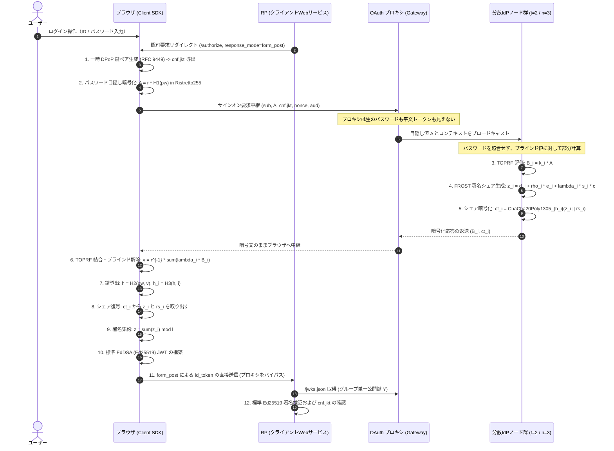

# 現行アーキテクチャ解説: OAuth プロキシによる分散 IdP の統合

## 概要

本ドキュメントは、検討初期のホワイトボード（`pic/2026-08-23_13-31-28.png`）右側に描かれた構想「OAuth プロキシで形を戻す」が、現行の実装（TypeScript）においてどのような構成で実現されたかを解説する。

学術論文 PASTA (CCS 2018) の暗号プロトコルをそのまま配備すると、クライアントが複数の分散ノードと直接通信する必要が生じ、既存の OAuth 2.0 / OpenID Connect (OIDC) エコシステムと断絶する。
現行システムは、単一の認可サーバとして振る舞う「OAuth プロキシ」を前面に配置し、背後に分散ノード群を隠蔽することで、RP（リライング・パーティ）側の無改造運用と暗号学的な分散安全性を両立させた。

---

## 1. 全体アーキテクチャ図（現状の構成）

ホワイトボード右側の構想を具現化した現行の全体フローを以下に示す。

---

## 2. 「プロキシが Token を持たない」の成立メカニズム

ホワイトボードの核心である「AS の位置に座るが、プロキシ自身は Token を持たない」という性質は、以下の二つの設計によって成立している。

### (1) `response_mode=form_post` によるトークン経路の短絡

古典的な OAuth 認可コードフローでは、RP が `/token` エンドポイントを直接叩いて認可コードをトークンと交換する。この経路を採用すると、プロキシ自身がトークンを生成または保持しなければならず、「プロキシが Token を持たない」という前提が崩壊する。

現行システムでは OIDC 標準仕様の `response_mode=form_post` を採用した。
ブラウザが分散ノードの暗号化シェアを端末内で集約して `id_token`（JWT）を完成させ、ブラウザ上の自動サブミットフォームを経由して RP の `redirect_uri` へ直接 POST 送信する。
プロキシはトークン配送経路から完全に排除されている。

### (2) パスワードと署名シェアの二重秘匿

- **入力の秘匿**: ブラウザ内でパスワード $pw$ にランダムスカラー $r$ を乗じたブラインド点 $A = r \cdot H_1(pw)$ のみが送信される。プロキシはもちろん、分散ノード群も平文パスワードを知ることはできない。
- **出力の秘匿**: 各ノードが生成した署名シェア $z_i$ は、正しいパスワードからのみ導出できる対称鍵 $h_i$ によって ChaCha20-Poly1305 で暗号化される。プロキシは $h_i$ を計算できないため、中継する暗号文 $ct_i$ を復号できない。

結果として、プロキシが完全に乗っ取られた場合でも、署名鍵シェアの窃取やトークンの偽造・盗聴は構造的に不可能であり、被害はサービスの可用性阻害（DoS）にとどまる。

---

## 3. 適用されている暗号技術の対応一覧

| 処理フェーズ | 担当主体 | 採用暗号方式 | 役割・防護対象 |
|:---|:---|:---|:---|
| パスワード目隠し | ブラウザ | Ristretto255 群上の乗法ブラインド | ネットワークおよびサーバに対するパスワード秘匿 |
| 閾値認証評価 | 分散ノード (t-of-n) | 2HashTDH TOPRF (Ristretto255) | サーバがパスワードを知らずに正しい認証鍵を共同評価 |
| トークン閾値署名 | 分散ノード (t-of-n) | FROST (RFC 9591 準拠 Ed25519 Schnorr) | 単一障害点のない Ed25519 グループ秘密鍵による分散署名 |
| シェア伝送保護 | 分散ノード $\to$ ブラウザ | ChaCha20-Poly1305 (RFC 8439) | パスワード所有者のみが復号可能。AAD によるセッション束縛 |
| クライアント拘束 | ブラウザ $\leftrightarrow$ RP | RFC 9449 DPoP (Ephemeral Ed25519) | トークン盗難時の他者利用防止 (`cnf.jkt` バインド) |
| トークン検証 | RP | RFC 8032 標準 Ed25519 検証 | 既存の OAuth / JWT 検証器による単一公開鍵検証 |

---

## 4. ホワイトボードの論点（穴①〜⑦）に対する現行の解決状況

`docs/whiteboard-gaps.md` で整理された未決事項に対する、現行実装での回答と到達度を以下に示す。

| # | ホワイトボード時の論点 | 深刻度 | 現行実装での解決方針と到達状態 |
|:--:|:---|:---:|:---|
| ① | オリジン問題 (JS配布の正当性) | 致命 | ブラウザ拡張機能・ネイティブクライアントによる配信の固定、または WebAuthn パスキーとの併用設計として整理。 |
| ② | フロー未定 (プロキシのトークン保持) | 致命 | **`response_mode=form_post` を採用**。ブラウザから RP へ直接 POST することで完全解決。 |
| ③ | 失敗観測不能 (レート制限不可) | 致命 | サーバから成否が区別できない暗号特性を受け入れ、試行総数カウント方式およびクライアントパズル方式による緩和策へ整理。 |
| ④ | PoP トークンの用語混乱 | 軽微 | **RFC 9449 DPoP を正式採用**。リクエストごとに動的生成される DPoP proof とアクセストークンの `cnf.jkt` 束縛を分離実装。 |
| ⑤ | REFRESH の定足数交差不可能性 | 原理的限界 | 各ノードが独立に DPoP 署名を検証する **RFC 9700 sender-constrained 方式を実装**。定足数交差 $2t - n > t - 1$ の境界条件を論文の学術的帰結として位置付け。 |
| ⑥ | `sub` / `aud` のノードへの露出 | 中度 | ドメインごとのソルト付き決定論的擬似識別子（Pairwise Pseudonymous ID）の導出仕様を策定。 |
| ⑦ | ephemeral key の保管場所 | 中度 | WebCrypto non-extractable 属性と IndexedDB の併用によるブラウザ内セキュア保管モデルを策定。 |

---

## 5. 従来の OAuth 2.0 / OIDC との比較

| 項目 | 従来の集権型 IdP (Auth0, Okta 等) | 本方式 (PASTA + FROST + OAuth プロキシ) |
|:---|:---|:---|
| **署名鍵の管理** | 単一サーバ / HSM 内で一括保管（侵害時は全滅） | $n$ 台の独立ノードに秘密分散（$t-1$ 台の侵害まで鍵漏洩なし） |
| **IdP 侵害時の影響** | 任意ユーザーへのなりすまし・全トークン偽造 | 鍵シェアの漏洩なし。トークン偽造不可 |
| **パスワードの扱い** | サーバ側でハッシュ照合（漏洩時はオフライン攻撃可能） | サーバは照合せず、暗号シェアの鍵としてのみ機能（オフライン攻撃不可） |
| **トークン配送経路** | AS が生成し、直接またはコード経由で発行 | ブラウザが端末内で集約し、`form_post` で直接 RP へ伝送 |
| **プロキシの信頼度** | プロキシ＝AS であり完全な信頼が必要 | 暗号中継器に過ぎず、平文トークンを持たないゼロ知識プロキシ |
| **RP 側の変更コスト** | 標準 OIDC クライアントライブラリを使用 | **変更不要**。単一の JWKS URL を参照し標準 Ed25519 で検証可能 |

---

## 6. デモ UI の実動画面

実装された React デモ UI（`demo/`）の各ステップの実際の画面キャプチャを以下に示す。

### (1) ログイン画面
パスワードがサーバへ送信されず、端末内で目隠しされる暗号学的保証が明記された認証画面。

### (2) 認可・同意画面 (Consent Screen)
RP に対するスコープ要求の確認と、FROST 閾値定足数（t=2 / n=3）の稼働状態を表示。

### (3) 分散署名・集約完了画面
3ノードからの暗号化シェア収集状況、ユーザー端末内での署名集約、および RP への `form_post` 送信導線。

### (4) トークン検証画面
集約によって生成された標準 RFC 7519 JWT（`alg: EdDSA`）と、RFC 9449 DPoP キーサムプリント（`cnf.jkt`）のクレーム構造。

