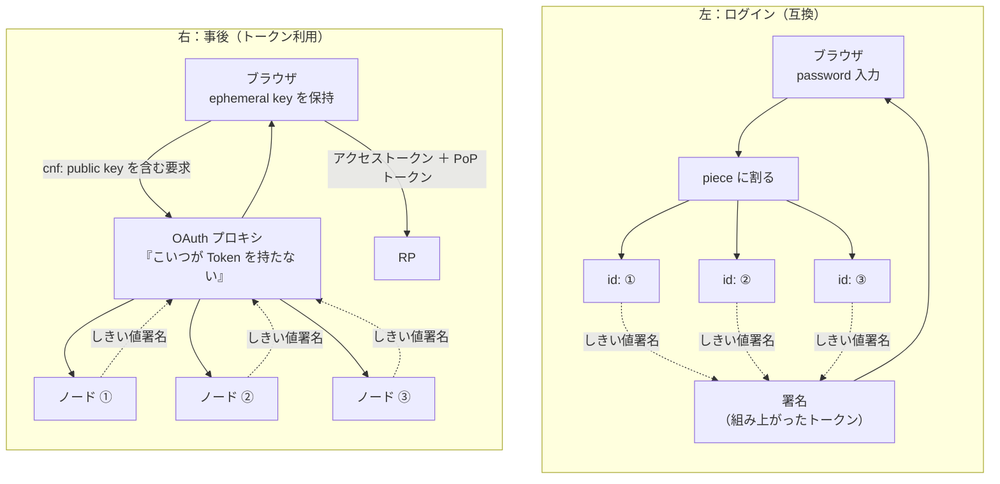
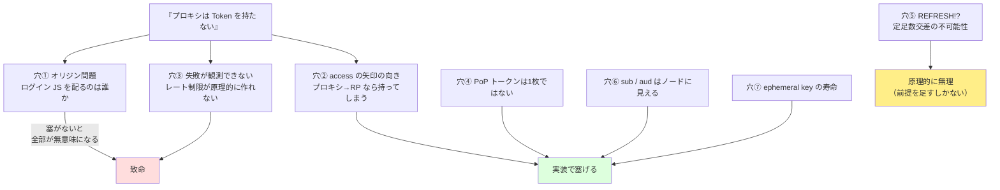
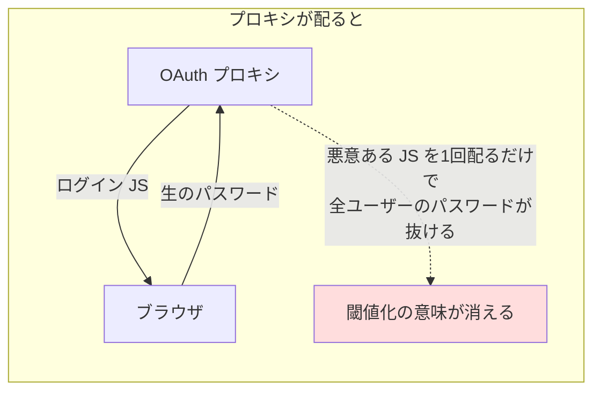
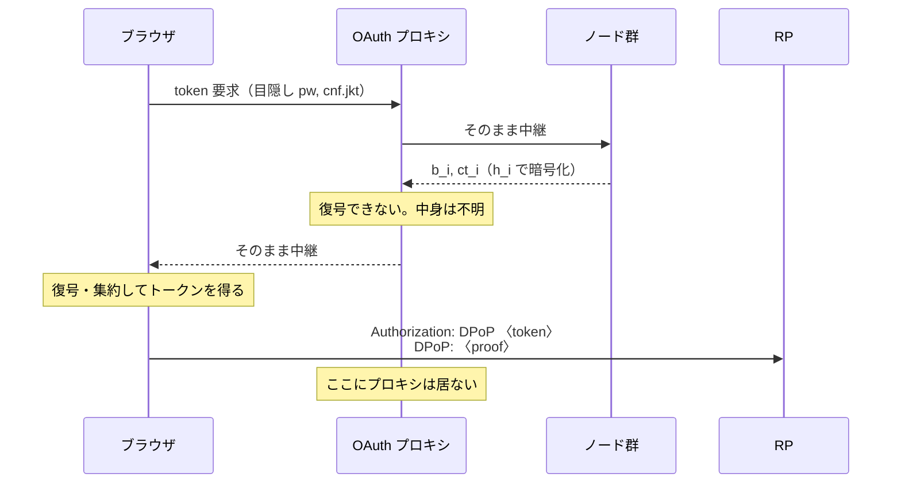
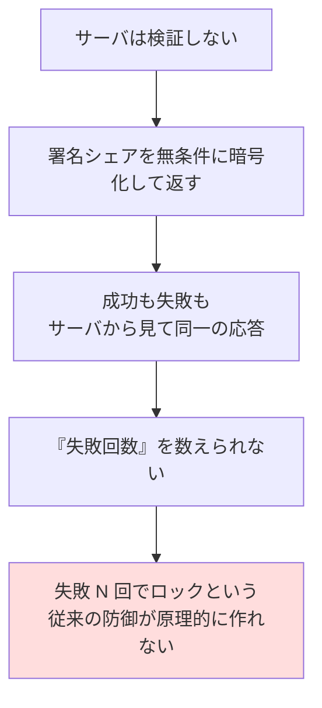
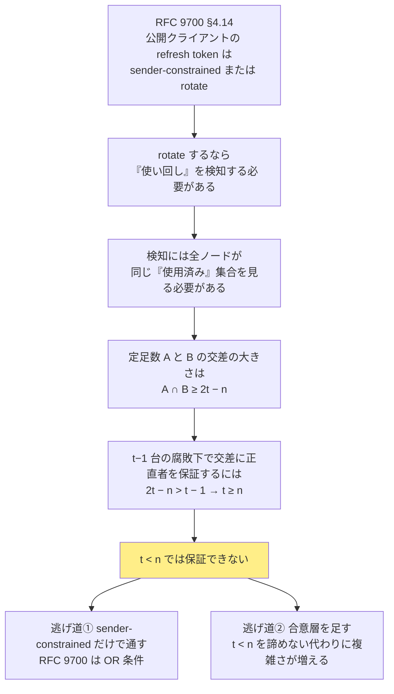

# ホワイトボードの設計と、そこに開いている穴 (2026-08-22)

`pic/2026-08-23_13-31-28.png` の議論を起こしたもの。
**描かれている構成**と、**まだ塞がっていない穴**を分けて書く。

板書の隅に「**火までに検討**」とあるので、期限は **2026-08-25（火）**。

---

## 1. 描かれている構成

左が「従来の Auth との**互換**」、右が「**事後**（トークン発行後）」。
両方とも「OAuth の形を壊さない」という同じ主張の別々の側面になっている。

構成そのものは PASTA + DPoP で成立している。
**問題は「こいつが Token を持たない」という一行が、どこまで本当か**という点にある。

---

## 2. 穴の一覧

---

### 穴① オリジン問題 — ログイン画面の JS を配るのは誰か 🚨

**いちばん大きい穴。** 板書には描かれていない。

パスワードは目隠し（blind）してからでないとネットワークに出せないので、
**目隠しの処理はユーザーのデバイス上の JS で走る**。ではその JS を配信するのは誰か。

**信頼の対象が「プロキシは復号できない」から「プロキシが配るコードは正しい」へ移ってしまう。**
これはブラウザ暗号の古典的な問題で、暗号プロトコルの側では塞げない。

想定できる出口は3つ。どれも一長一短。

| 出口 | 内容 | 代償 |
|:--|:--|:--|
| ネイティブ / 拡張機能 | 配信経路をプロキシから切り離す | 「ブラウザだけで動く」を捨てる |
| コード署名 + 透明性ログ | 配布物のハッシュを公開ログに載せ、ブラウザが検証 | ログ基盤が要る。ブラウザ側の検証手段が弱い |
| ノードが各自 JS を配る | t 個のオリジンから取得してハッシュ照合 | ブラウザからは実装しづらい。UX が壊れる |

**PESTO も PASTA もここは扱っていない**（どちらもクライアントを所与としている）。
逆に言えば、ここを正面から扱えば実装寄りの会議では新規性になりうる。

---

### 穴② `access` の矢印の向き 🔧

板書では `OAuth プロキシ ---access---> RP` と点線が引かれている。
**この向きのままだとプロキシがアクセストークンを持ってしまい、板書自身の注記と矛盾する。**

正しくは:

**プロキシは「集約者」ではなく「中継者」。**
`ct_i` が `h_i` で暗号化されているので中継しかできず、そこが安全性の根拠になる。

| プロキシにできること | 可否 | 理由 |
|:--|:--:|:--|
| トークンを偽造する | ❌ | 署名鍵シェア `s_i` を持たない |
| トークンを盗み見る | ❌ | `ct_i` を復号できない（パスワードが要る） |
| 可用性を壊す | ⭕️ | ゴミを返せば DoS。ただし検知はできる |
| 誰がログインしたか観測する | ⭕️ | `sub` は見える。ノードも見えるので追加の損失は無い |

脅威は**可用性とプライバシ**であって**不可分性ではない**。
だから RP から見た OAuth のネットワーク形状を変えずに閾値化できる（論点E の答え）。

---

### 穴③ 失敗が観測できないのでレート制限が作れない 🚨

板書の「**ID・PASS は誰が CHECK**」に対する答えは「**誰もしない**」。
これは PASTA のいちばん綺麗なところだが、**副作用が板書に書かれていない**。

**これは実装漏れではなく、方式の帰結。**
成功と失敗がサーバから区別できないことが安全性の根拠（＝オフライン辞書攻撃を防ぐ）なのに、
同じ性質がレート制限を殺している。

代替は「**試行そのもの**を数える」しかない。

| 方式 | 内容 | 問題 |
|:--|:--|:--|
| 総試行数で絞る | 成否に関わらず `sub` ごとに N 回/時 | 正規利用者も同じ枠を食う。DoS になりうる |
| クライアントに仕事をさせる | proof-of-work / パズル | 攻撃者の方が計算資源を持つ |
| 成功したら本人に通知させる | 事後検知に倒す | 予防にならない |

`status.md` の「レート制限 🔺 構造は得た」は**楽観的すぎる**ので、ここを根拠に下方修正すべき。

---

### 穴④ 「PoP トークン」は静的な1枚ではない 🔧

板書は「アクセストークン ＋ PoP トークン」を並んだ2枚の箱として描いているが、
DPoP（RFC 9449）では PoP 側は**リクエストごとに新しく作る証明**。

| | 実体 | 寿命 |
|:--|:--|:--|
| アクセストークン | ノードが閾値署名した JWT。`cnf.jkt` を含む | 5 分（`TOKEN_LIFETIME`） |
| DPoP proof | ブラウザが ephemeral key で**毎回**署名する JWT。`htm` / `htu` / `iat` / `ath` を含む | 1 リクエスト |

用語だけのズレで設計は壊れていないが、**「持ち回るもの」と「都度作るもの」を混ぜると
ephemeral key の保管要件（穴⑦）を見誤る**ので分けて書く。

---

### 穴⑤ REFRESH!? — ここだけは原理的に無理 ⚠️

板書の右下、赤字級に大きく書かれている箇所。設計自体は `refresh-token.md` で済んでいる
（`h_i` の代わりに sign-on 時に配った `rs_i` で開ける）。**残っているのは再利用検知**。

**この不可能性が、いまのところ一番論文になりそうな部分**（`status.md` の投稿方針を参照）。
穴として塞ぐより、**結果として書く**方が価値がある。

---

### 穴⑥ `sub` / `aud` はノードから見える 🔧

Issue #81 の「問題②（プライバシ）」は**未解決のまま**。
板書では触れられていないが、ノードは署名対象の平文を見るので、
**誰がどのサービスにログインしたかがノードに漏れる**。

閾値化しても隠れない。隠すには盲目署名か、`sub` を per-`aud` の擬似 ID にする必要がある。
後者は決定的な導出で足りるが、RP をまたいだ名寄せができなくなる副作用がある。

---

### 穴⑦ ephemeral key の寿命と保管 🔧

板書は鍵アイコンだけで、どこに置くかが描かれていない。ここが決まらないと穴⑤も決まらない。

| 選択肢 | 抽出耐性 | タブを閉じたら | リフレッシュとの相性 |
|:--|:--|:--|:--|
| WebCrypto non-extractable + IndexedDB | ⭕️ JS から取り出せない | 残る | ⭕️ 良い |
| メモリのみ | ⭕️ | 消える | ❌ 毎回ログインし直し |
| localStorage に生の鍵 | ❌ XSS で抜かれる | 残る | DPoP の意味が消える |

**推奨は non-extractable + IndexedDB。** DPoP の前提（鍵をエクスポートできない）を満たす唯一の現実解。

---

## 3. 優先順位

| # | 穴 | 深刻度 | 性質 | 火（8/25）までに |
|:--:|:--|:--:|:--|:--|
| ① | オリジン問題 | 🚨 致命 | 暗号では塞げない。方針決定が要る | **決める** |
| ③ | レート制限が作れない | 🚨 致命 | 方式の帰結。緩和策の選択 | **決める** |
| ⑤ | refresh 再利用検知 | ⚠️ 原理的に無理 | 塞がず「結果」として書く | 書き方を決める |
| ② | access の矢印 | 🔧 軽 | 図の修正のみ。反映済み | 済 |
| ④ | PoP の用語 | 🔧 軽 | 用語の分離のみ | 済 |
| ⑦ | ephemeral key | 🔧 中 | 実装で塞げる。⑤の前提 | 方針だけ |
| ⑥ | `sub` / `aud` の露出 | 🔧 中 | 未解決。スコープ外にするか判断 | 判断 |

**①と③は「実装すれば直る」類ではなく、どちらも設計判断が要る。**
火曜までに決めるべきはこの2つ。

---

## 関連

- [readme.md](readme.md) — 全体の入口
- [implementation.md](implementation.md) — PoC の中身と役割整理（穴②を反映済み）
- [refresh-token.md](refresh-token.md) — 穴⑤の設計
- [status.md](status.md) — 到達度と投稿先
- [prior-art.md](prior-art.md) — PASTA / PESTO との差分
